https://www.udemy.com/course/advanced-solidity-understanding-and-optimizing-gas-costs/learn/lecture/31856136#overview

Let's start with a very simple function that just takes the variable A adds one to it and returns it.

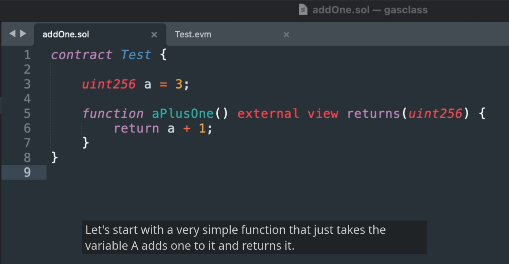

Now, when we look at this as a programmer, semantically this is not ambiguous.

We just say, okay, just, you know, take whatever variables here, add one to it and give it back to me.

But that kind of language is not ambiguous, is not unambiguous to a computer.

For a computer to execute this, it needs to know where exactly in memory or storage is.

A I can't just add numbers in storage.

I need to move that number from storage into memory.

And you cannot just say, Oh, add a number to it.

That number you're trying to add needs to be loaded into memory to not only that, it needs to be loaded into a very specific location so that when you do the addition operator, the addition knows where to look for these two numbers in order to add them together.

So something that might look very simple like this under the hood requires a lot of very tiny and precise instructions in order for a computer to understand it.

And that's what assembly code is.

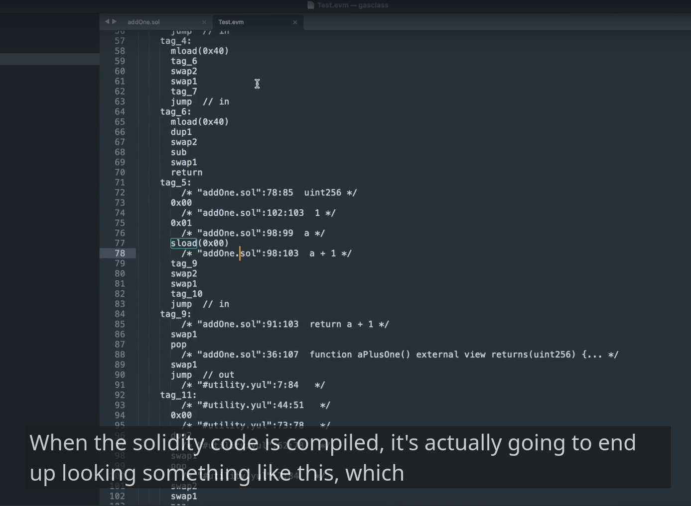

When the solidity code is compiled, it's actually going to end up looking something like this, which might seem kind of scary.

But as we look through it, these are all just very simple operations that are carried out on the Etherium

computer when it's trying to execute this smart contract rather than trying to walk you through this little by little.

I'm just going to try to focus on the parts that are relevant and informative here.

Here's our smart contract.

Again, part that would be relevant is the operation of adding offloading the numbers and adding them.

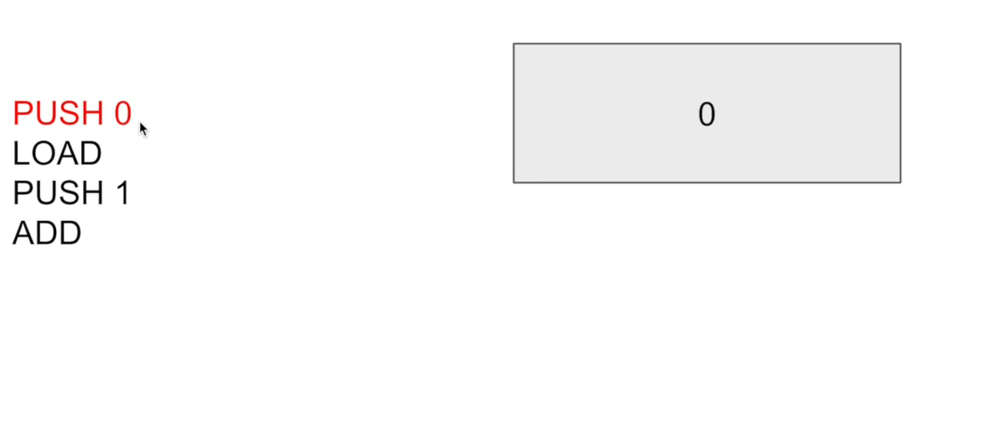

So let's assume, just for the sake of an argument, that we know that **A is stored in location zero**.

So **zero is not a number**.

We are doing math with it saying zero was a storage location for a we need to tell the computer, hey computer **look inside of location zero** and okay, so we just stored location zero there and then what are we going to do with that zero?

Well, we're going to **take the value that is inside of location zero, the byte values over there and load those into memory**.

Well, removing this value, once we have loaded those values, this zero is not relevant to us anymore.

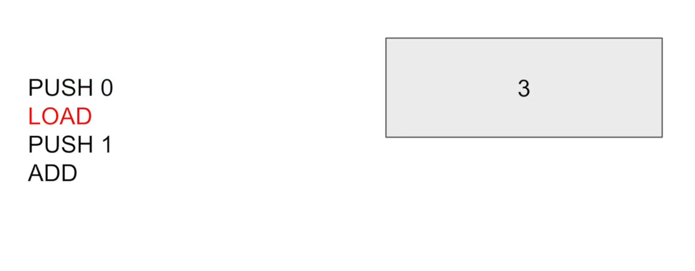

So when we execute the **`LOAD` operation**, we're going to **pull in what was stored at location zero**, which is **three**.

**We can't just say add one** because the computer doesn't have a notion of adding a specific number or incrementing.

At least Etherium doesn't.

Instead, what we need to do is **explicitly load in the number that we're trying to add** it with, which is **`PUSH 1`**.

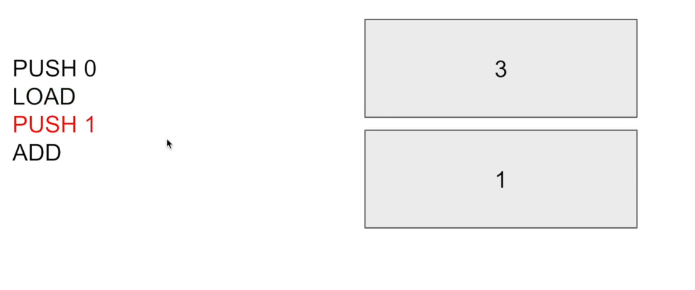

At this point, the semantic of push might start to become intuitive when we did a push that put that number onto the stack.

So you can think of **all of the information that is being stored in the intermediate states of being in the computation as being numbers on top of a stack**.

That is so that when the operation comes along, it knows that I only have to look at the top two items inside of the stack in order to carry out my operation.

**If I if my one and three were not at the top, two elements of the stack add would not work** because it's specifically programmed to only look at the top two elements in the stack.

So it pops off the two items and adds them together and gives us four.

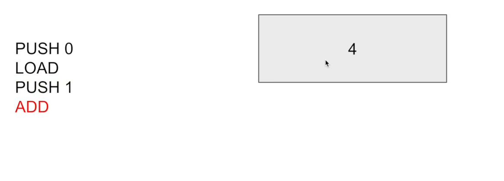

`So this sequence of codes is what under the hood Etherium is executing to execute X plus one.`

Now, when we looked at the op codes, we noticed, okay, there were a lot more than four over there.

Well, that's because we need to do stuff like setting up the functions.

And there's also the constructor part of the Smart contract.

But I don't want to get into that right now, just for the sake of simplicity.

Let's look at something a little bit more complicated.

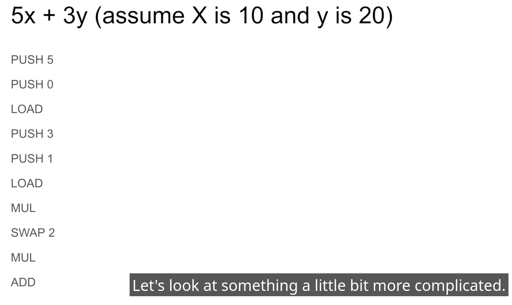

**5x + 3y**.

And let's assume that we have X storing the value of ten and Y storing the value of 20.

And let's step through how this would be executed inside of the virtual machine after it was compiled.

Well, first

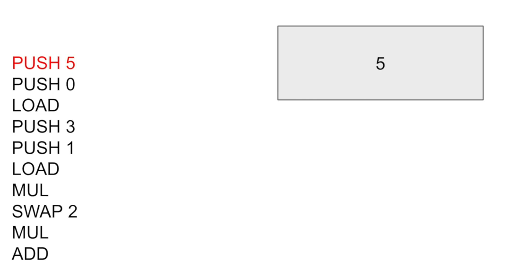

- we need to push five onto the stack because we're trying to do five X plus three Y.
- Then we will push on the storage location of X, which is zero.

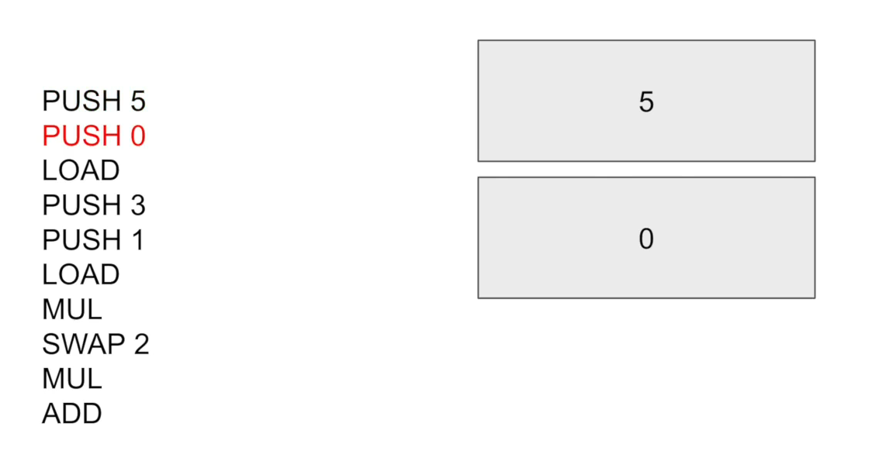

- We will load the value from X onto the stack while removing the most recent item on the stack, and that will replace the zero with the ten.

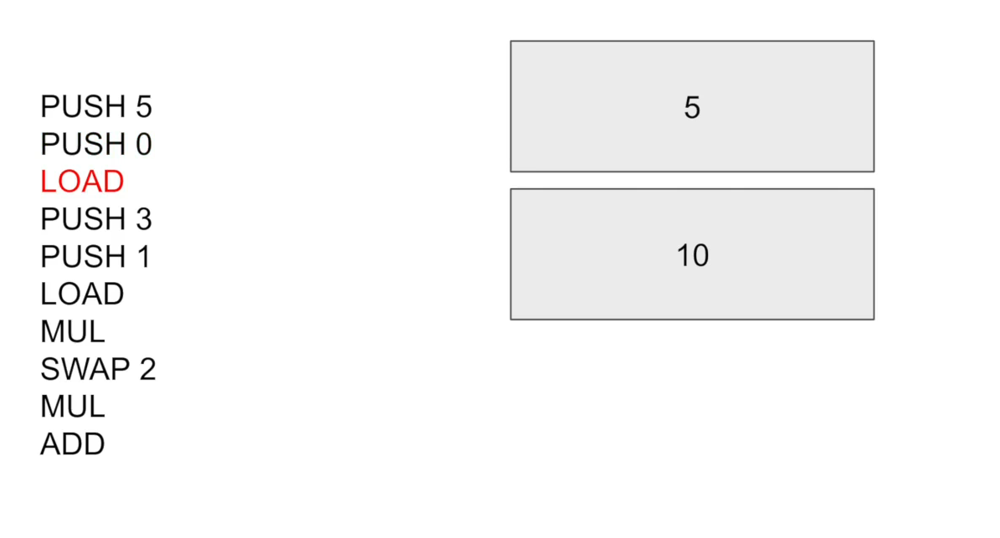

- Then we will push the three onto the stack to correspond to the three Y

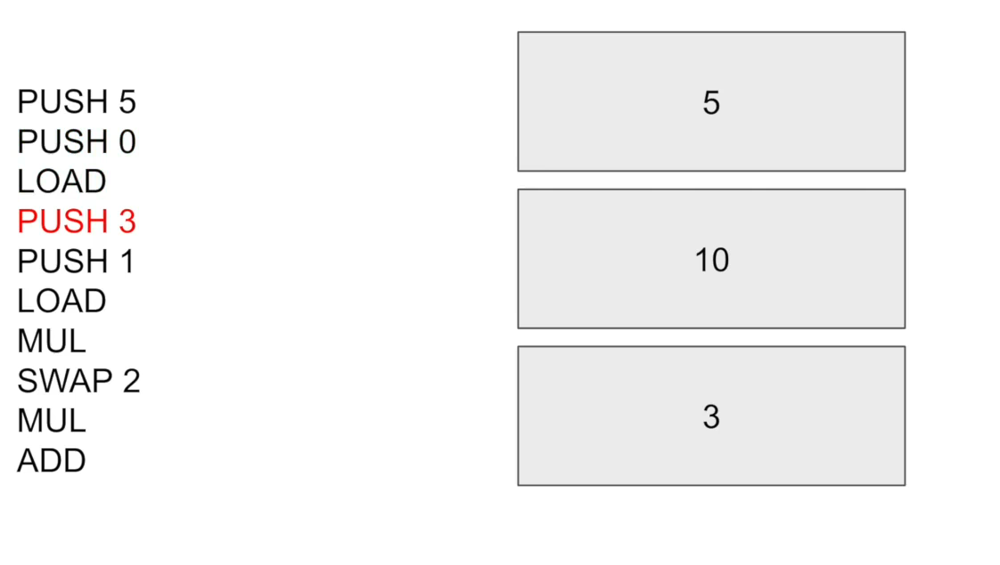

- And then push the storage location of Y, which is, let's just say **one**.

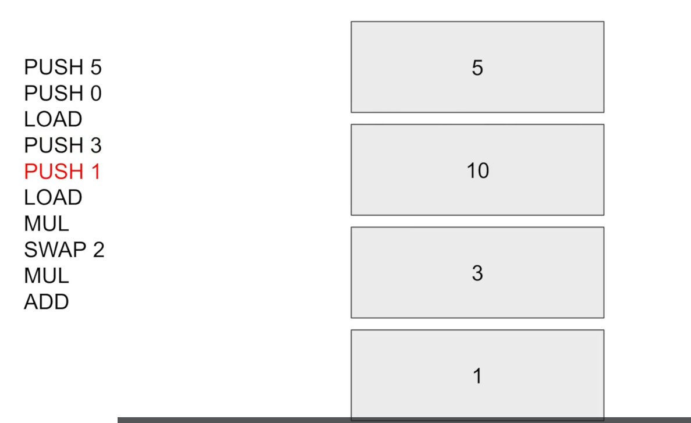

- In this case we will load the value of Y onto the stack

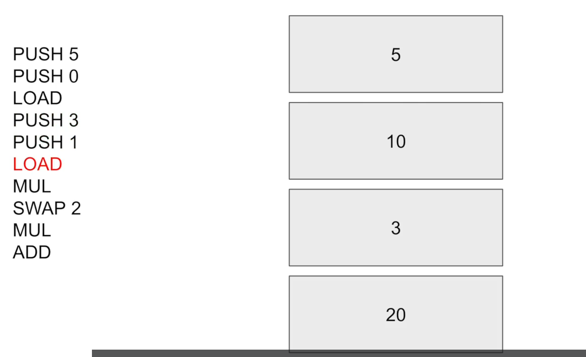

- And then multiply these two numbers together.

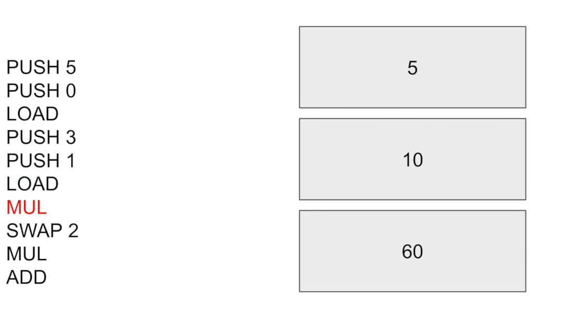

Now remember how I said multiplication only or these?

Well, I said addition.

But it's true of multiplication too.

You can't multiply six by ten.

That doesn't correspond to the actual mathematics of what you were doing.

So if the compiler had set up the codes to look like this up to this point, what it would actually have to do to do the math properly is compile a **swap** operation to move that 62 units back and make sure that the two relevant numbers are on the top.

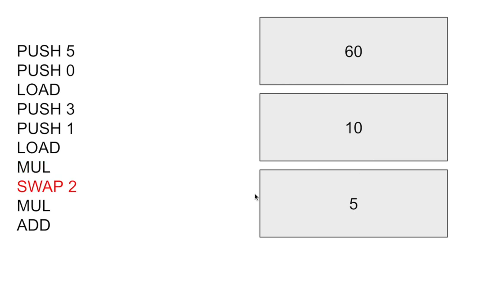

Because these mathematical operators that take into arguments only look at the top two most items.

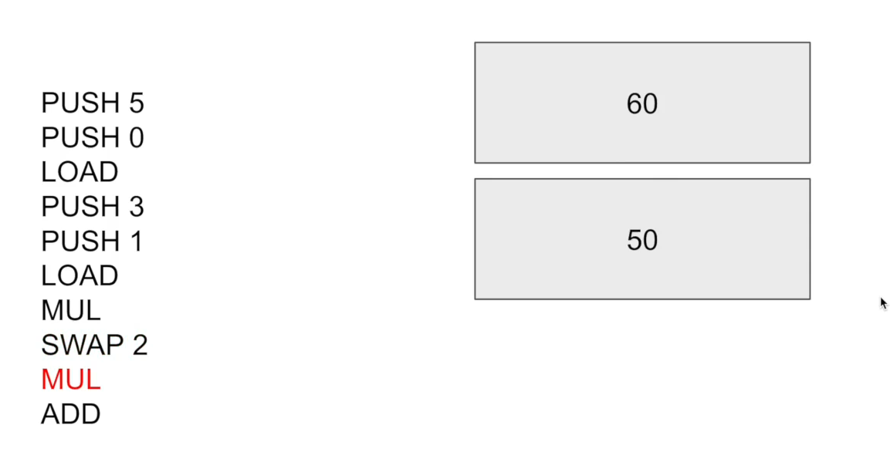

So that will carry out the multiplication and then add them together.

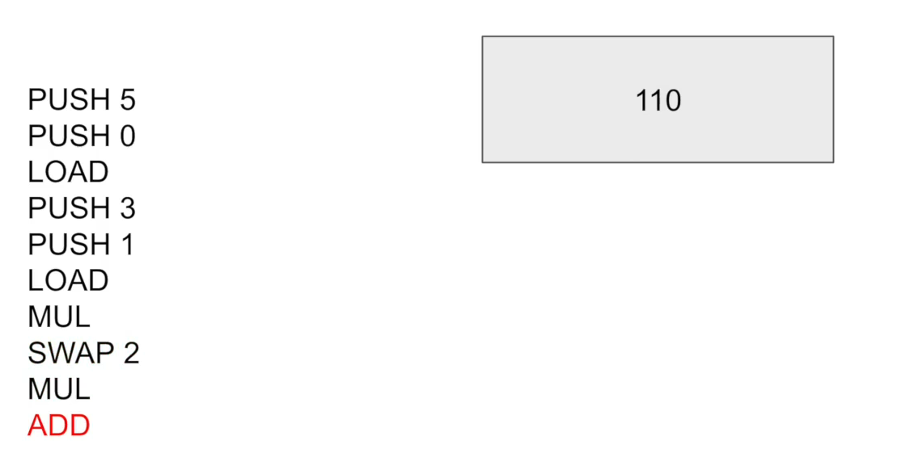

This sequence of opcodes means technically you can technically you can program Etherium in any language as long as it compiles to the appropriate opcode codes.

That's why we have **viper** and **solidity** now.

Mark could be added later.

Those two are the ones that are supported for now.

In order to really understand gas costs, you will need to have a good intuition about what sort of

solidity code gets turned into different OP codes, because I'll describe in the next video how these up codes allow us to calculate what the gas cost will be.