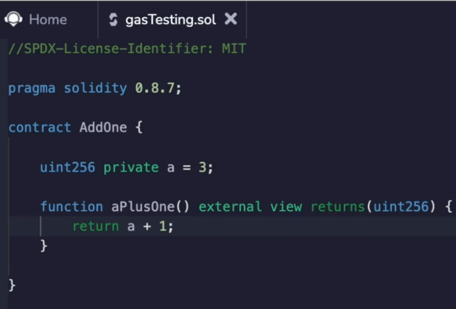
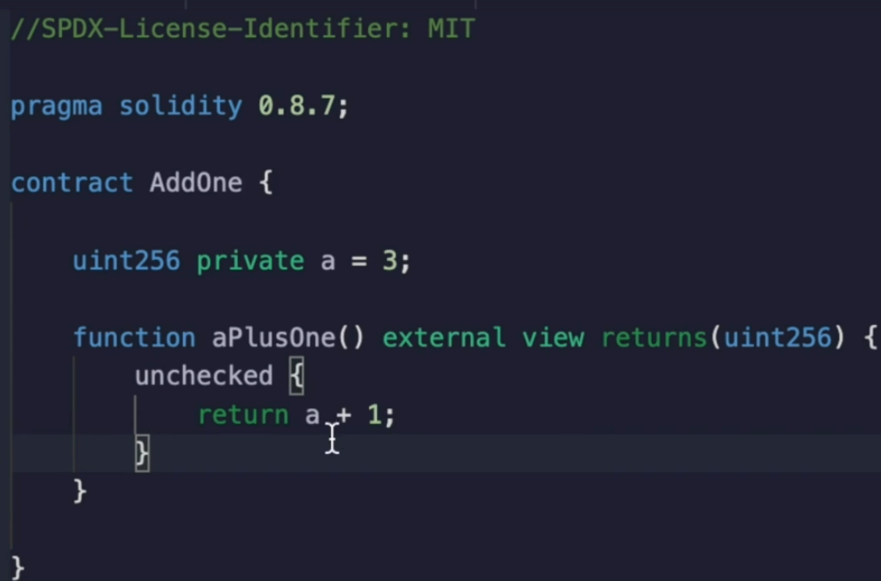
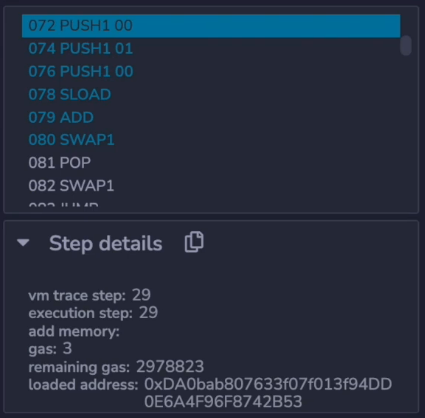
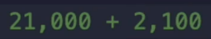
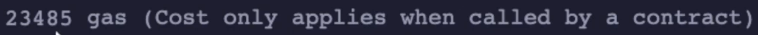

https://www.udemy.com/course/advanced-solidity-understanding-and-optimizing-gas-costs/learn/lecture/31856150#overview

Here is our smart contract that takes the variable A and adds one to it.

I'm going to compile this and show you the codes and step through the codes.

But before I do that, I'm going to make the compilation a little bit simpler by putting this code inside of an **`unchecked box`**.

Now I'll explain this uncheck box in more detail in an upcoming video.

But in **solidity, 0.8 or higher**, you actually get overflow protection built into the arithmetic.

But that overflow protection makes the compiled code a little bit more complicated.

So for the sake of simplicity, I'm going to remove the overflow and under flow protection.

We'll go into this in more detail in a later video.

So don't worry if you don't fully understand this for now, I compile this and deploy and execute the transaction.

It's far as we expected.

Now let's actually look at what's happening on the up code level.

I'm going to click debug over here and it's looking at this transaction that we just executed.

And as I step through it, it **pushe zero** on to the stack, **pushe one**, **pushe zero** again, executes an **sload**, conducts an **add**, conducts a **swap**, does a **pop**, a **swap** and a **jump**.

Okay, that seems a lot more complicated than what we did in the slides earlier.

And there's a reason for that which we won't get into right now.

However, you can see the core operations that are relevant to accomplishing this function.

Right before we did an **`SLOAD`** over here, we had to push the **storage location of A** onto the stack, which we know at compile time is zero.

And earlier we pushed a one onto the stack.

Right?

So there's that one push, one pushed the zero load to zero and add them together.

Now, there's actually more to this execution than what we just showed here, because there's a function call and you need to jump to that particular location when you execute the code.

So when we clicked debug, it didn't take us quite to the beginning of the execution.

The execution actually starts all the way back here and here you can see it doing a bunch of other stuff that it needs to prepare before it can make the jump to the function that we're doing.

This might seem like a lot.

Don't worry, we're actually going to get into this later.

But this actually is how solidity is able to tell you what the gas cost is.

I'm sorry, solidity.

And this is how remix is able to tell you what the gas cost is.

Over here we have **23,485 gas**.

Well, let's see if that actually makes sense as a rough estimate.

Remember, it costs **21,000** gas to do anything on this area.

So that's how much the bare **minimum cost** to **call a function**.

Remember we said earlier that the loading from storage costs **2100 gas**.

So if we just add these two things together, forget all of the add swap and pop and what not.

Add swap and pop.

That sounds like a poem or something that wasn't intentional.

Anyway, so we have 21,000 plus.

2000 should come out roughly to 20, 23,000 something.

Right.

And that is actually what we have here, 23,000 plus all of the extra additions and bookkeeping that we need to do later on.

We'll actually step through those up codes one by one and see how we can make the costs add up to this.

But you get a sense of where the gas cost is coming from now.
