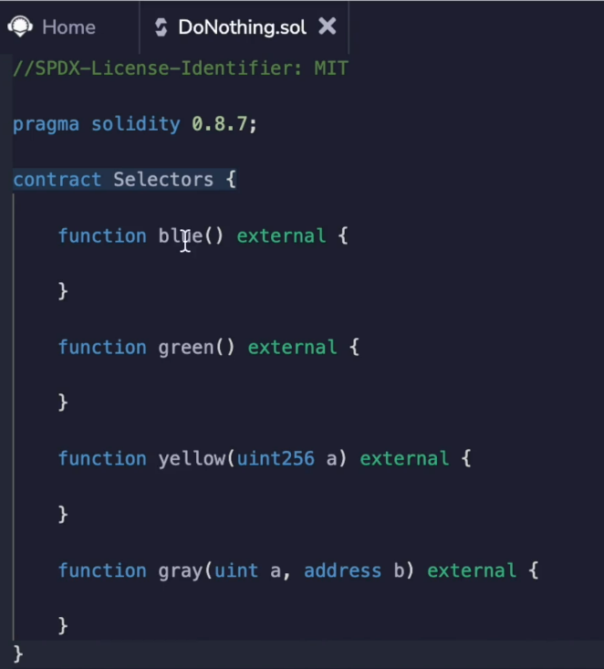
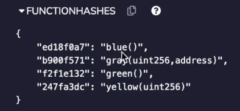
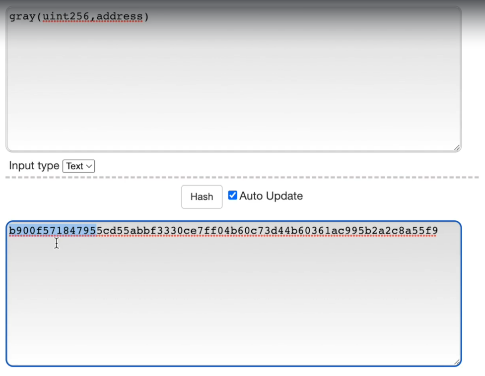
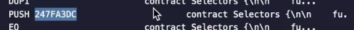

Before we're able to step through the options one by one and understand what's happening.

We have some prerequisite knowledge to cover with function selectors.

**When you create a contract, your function names are not actually stored inside of the byte code**.

So if I look at compilation details over here and look at the assembly output, you're not going to see blue, green, yellow anywhere here.

Okay, I'm scrolling kind of fast, but you can do this on your own if you want to see this.

How they are actually stored is as hashes of the **function name** and then the **first four bytes are taken**.

We had **blue**, **gray**, **green** and **yellow** and this is what their hash values are.

So if you take this string and hash it with a contract to 56 and take the first four bytes, this is what you'll get.

Now when you're doing this hash, **you have to make sure that you include the exact uint type** and you **don't include the variable name**.

So if we look at how I wrote Gray over here, it was **uint256** and **address**.

This was just uint and an address and **a** and **b** are **not included**.

But before you take the hash, this part needs to be included.

You see the same thing with yellow.

The variable name is a, but that gets dropped in here.

So if you want to compute this, you can just take any catch back to 56 library and plug it in.

And here you will take the **first four bytes** of it and that's actually what you get. **b900f571** something b900f571 not going to read enough.

And here we can find it inside the compiler output.

Let's see if we can find one of these function hashes.

Okay.

There's **247F...**, which I think was **yellow** function.

We have **b900f571**, which was gray, etc., etc..

So this is how it's actually stored inside of the byte code.

And now we'll be able to understand what this represents when we step through the byte code in the next video.