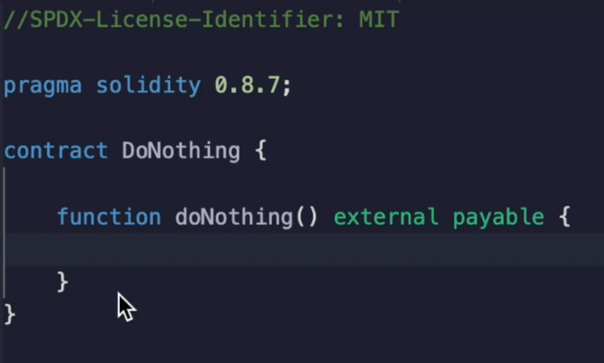
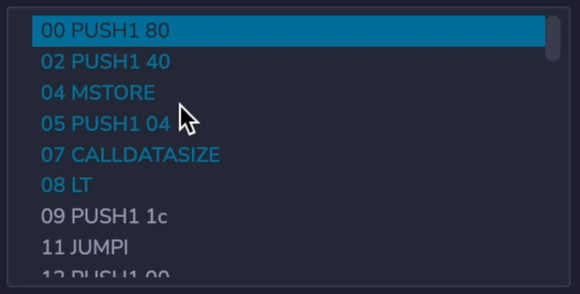
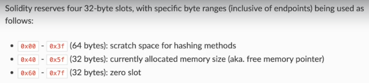
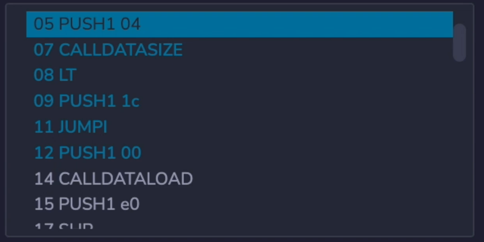
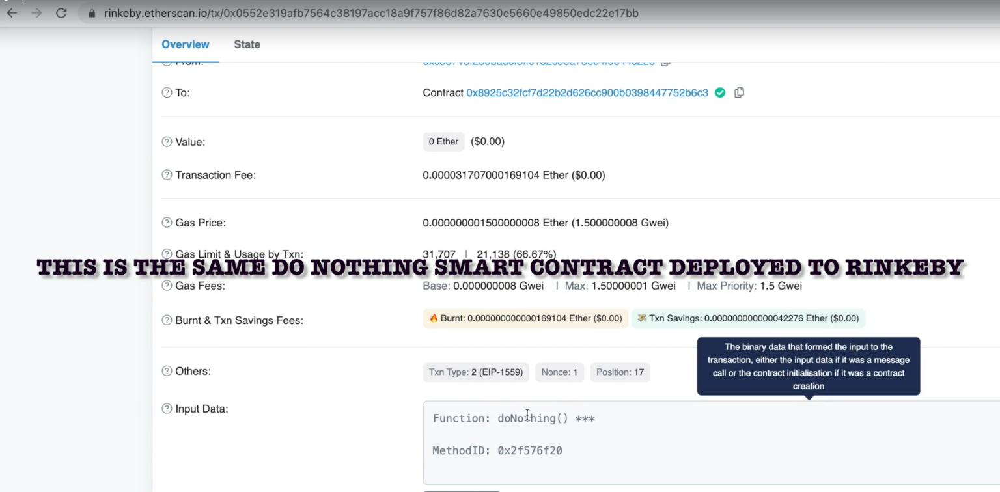
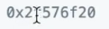
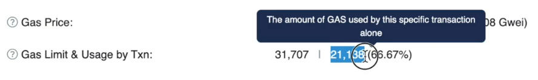
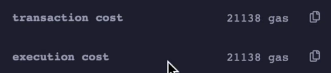
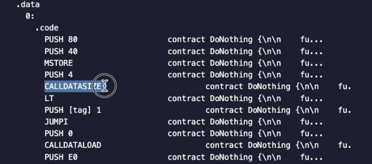

All right.

Now we are ready to look at the op codes of a real smart contract to make this as simple as possible.

I've created a function that doesn't do anything, and I've also made it **payable**.

This will actually simplify the output of the compiler.

And the reason for this is something I'll explain later.

The other thing I've done that we haven't talked about yet is that I've **turned on the optimizer**, which

will make the up codes fewer in number and thus make it easier to read.

Again, this is something I'll explain later when we execute this function of do nothing.

We'll see.

We're going to pay **21138 gas**.

And my objective in the next sequence of videos is to add up all the gas costs to see exactly how this number came about.

Obviously, the first thing we're going to do is look at the codes.

So let's go to the debugger and see what happens.

The first thing that happens is a **sequence of pushes** followed by an **`MSTORE`**.

What this actually corresponds to is solidity, allocating space for different operations that might be conducted in the future.

So the **first 64 bytes** are used as **scratch space** for **hashing methods**.

This one tells you how much memory has been allocated so far.

So **memory** and **solidity** is just a **long array** that you allocate more and more of as you need.

I'll explain memory more later.

And this is the zero slot where you would start like a bytes array or something like that if you were doing it in memory.

Okay.

That's what the first three episodes are doing.

And then it's going to push the hex number four on the stack **`PUSH1 04`** and hex four is also decimal four.

Okay.

Why is decimal four significant?

Well, if you look at the up codes here, what it's going to do is look at **CALLDATASIZE**, see if it's less than four, push a certain location on the stack and possibly jump to it.

Okay.

What is so important about call data size ?

And for when you interact with a smart contract, what you're actually sending is something inside of the input data field.

If you're using solidity, you would see this in message dot data.

But if I look at this like so you can actually see inside of this transaction was 2f57 whatever, whatever

I'm not going to read at all to you, but this is how you tell the smart contract I want to execute this particular function.

So typically you can go to the contract and then if someone already published the source code or the API, you can interact with it directly.

But that's not possible here actually because I haven't published the source code.

However, the theory and transactions simply work by just putting the hexadecimal data that you care about inside of the inside of the data field.

So that would look like this.

Let's say I wanted to execute this, **`DoNothing()`** function.

Then I would just open my **metamask** I'm going to send to this address.

I'm not going to send any ether, but inside of the hex data field, I will just put into F five, seven, six, f 20 and then confirm and send this transaction.

Now, let's speed it up a little bit, shall we?

Okay.

So this will take some time to confirm in the background.

But you can see over here we spent **21138 Gwei** when this was executed on the Ethereum testnet and it's **21138 gas** again here inside of the remix environment.

So here I am back at the Smart contract and it should be confirmed by now.

And here you can see now that function has been executed twice.

This is the one that not a set in metamask earlier.

And again, you can see it still costs 21,138.

Guess if you want to see what happens in the failure case, well, you can do that.

Let's look at the first failure case where we send less than four bytes.

So this transaction should fail.

We'll put one byte in there, and when I send this, it's going well.

The client behind the METAMASK recognizes that the transaction is going to fail.

And so it doesn't actually send it, but it actually hits a simulation of the transaction on its local client and says, Yeah, this isn't going to work.

But this **call data size** is how it knows that you've actually sent **four bytes** inside of your **message.data**.

Let me show you where is it?

The assembly code, so we can look ahead to see what's going to happen.

So at the actual execution, we saw allocating memory, pushing four bytes and checking that there were actually four bytes in here.

So when I put that those values into the message, that data portion of the transaction, if I've sent

less than four, then it's not going to be able to match the function selector later.

So first of all, it makes sure that there's actually four.

If there isn't, it's going to jump to tag one.

And over here we see a revert, which is going to cause the transaction to fail because it doesn't know which function selector it was going for.

Otherwise, it's going to check if the data you put in actually matches the function selector.

There's only one function here, so it just wants to check that you are making.

Make sure that you are actually calling that function.

If they are equal to each other, then it's going to jump to tag two, which is over here and then it will stop.

There's nothing inside of the function, which is why there's only the stop up code there.

Okay, let's go back to the debugger so you can see we're setup or for the push called data size less than and jump if.

It was less than four, but the jump doesn't happen.

It just keeps going on to the next line because we this transaction sent the correct amount of bytes and then it's going to load up that function selector inside of the stack and check if they're equal.

And then it jumps to the location that because it was in fact equal and stops.

Okay.

**Each of these codes have a gas costs which we can add up**.

We're not going to do that in this video because that will be too long, but we'll do it in the next one.

But over here you can see push costs three gas.

Another push car still costs three gas.

The M store costs three gas again.

And we have another push and I call data size, which costs two gas.

So we can add all of this up manually.

It's actually going to add up to 65 gas.

So if we add up 65 plus 21,000, which is for the cost for initiating a cerium transaction, we'll see.

It's not going to add up.

Now, why that is the case is actually quite interesting because there are other costs that we need to account for.

But in the next video, I'm going to load these up codes into an Excel spreadsheet so you can see the math for yourself.
