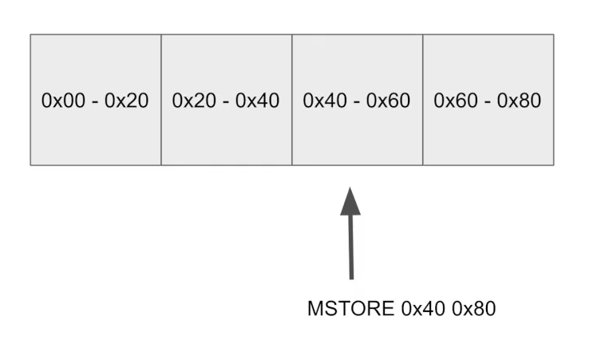

We are now ready to look at the final missing gas costs, which is actually attributable to memory.

**Memory in solidity is a long array that is indexed in 32 byte increments**.

So remember the `MSTORE` instruction ?

If we were to say `MSTORE 0xFF 0x00`  into the zeroth slot, this is what it would look like.

The first 32 bytes (LEFTMOST 31 BYTES) would be zero and the rightmost would have the hex value of inside of it, which

is all ones, and the remaining parts would be zero.

You can think of this is the same kind of memory and **like RAM**, this **only stays around as long as the transaction is being executed**.

Remember how we kept seeing `PUSH1 80`, `PUSH1 40`, `MSTORE` at the beginning of the function call?

What that's doing is it's looking in **slot 40** and storing the **value 80** over there.

These are in **hex values**.

This is actually **128** (decimal).

That is to fulfill this solidity specification over here.

**Just to give a quick visualization of memory slots**.

When I say something is stored **in slot zero**, that's means it's being stored **from zero to byte 32**.

Remember, **0x20** is **32** in decimal.

So this is
- zero through 32,
- 32 through 64
- and 64 through 96
- and so forth.

So the Operation `MSTORE 0x40 0x80` is saying store inside of slot 64.

So from slot 64 to 96, store the value **0x80**, which is **128**.

If you are curious where this number 128 is coming from, it's simply the sum of all of these bytes over here, 64 plus 32 plus 32 is 128 or 080.

In hexadecimal, **solidity will always allocate these values** regardless of whether or not you actually use them.

That's just how the compiler works.

So the **first 64 bytes** are a **scratch space** for **hashing methods**, and this **32 bytes slot** is where that **0x80** is being stored.

So it's saying we've currently allocated **128 bytes** or **0x80**.

So `MSTORE 0x40 0x80` is putting the 0x80 inside of the slot.

And if we were to actually be using the memory and allocate more of it, it would begin at slot zero x 80.

And you can see that in the specification here because it takes the arguments where is the starting point in memory that we're going to store the value and it goes from the starting point to the starting point plus 32 and stores the value there.

So after we execute this operation, then the number 128 in decimal or 80 in hex will be stored in the third slot of memory.

What could happen if we had done something other than push 40 of storing it in the byte slot corresponding to hex 40?

Well, if we had done `MSTORE` some value into slot zero, it would be using slot zero through zero x 20.

So this is from 32 to 60 4 to 96.

And every time for every 32 byte segment that you allocate, you pay three guess.

You can actually see that inside of the Etherium White Paper right here.

So **Gmemory** for every word or these 32 bytes that you allocate in memory, then you will pay three.

Guess for it.

It's a little more complicated than that, but that's all you need to worry about for now.

**Even if you don't use the previous slots, you're still going to be charged three guess for them anyway**.

So if you write to slot 100, you're still charged as if you had written to the 99 slots before it, or it doesn't matter if you wrote to it or not.

You're just charged.

And here you might be seeing how the pieces can start coming together.

When we do this operation, we are writing from slot 42, slot 60, and from 0 to 60 we're actually using up three slots and each of these three slots costs three gas and there is our missing nine gas.

So when we add all of this up, we actually get 21,138, which is the same value as the transaction.

Okay.

Where do we go from here?

Well, I wanted to give you an overview of where all the different gas costs come from so that you know where to look, at least at a theoretical, foundational level.

I don't want to just give you a bunch of tips and tricks and you don't know why those tips and tricks work.

So there are five ways that you can save gas.

1. On **deployment**. The smaller the smart contract, the less gas you pay on deployment
2. During **computation**. Using fewer or cheaper op-codes saves gas on execution
3. **Transaction data**. The larger your transaction data, and the more non-zero bytes you have in it, the more gas it costs
4. **Memory**. The more memory you allocate, even if you don't use it, you pay more gas
5. **Storage**. Not covered yet, but it's a very important topic section. As you would expect, the more storage you usen the more you pay

- One is by making your smart contract smaller because the less bytecode you deploy to the blockchain, then that's less storage requirements for the nodes
- And during computation. So if you use fewer **EIP** codes or less up codes, then the execution of the transaction will be cheaper.
- And we saw how the transaction data part costs us either for gas or 16 gas, depending on whether our byte is zero or non-zero. So we want to write as few bytes as possible and we want most of them to be zero. And we'll be having a section on that where we cover tricks about how we can accomplish that.
- And we just looked at how memory. I guess the more memory you allocate, the more gas you pay. And interestingly, solidity doesn't have a garbage collector or anything like that, so you cannot allocate memory. So we'll be looking at tricks to avoid spending too much gas on memory.
- And finally, storage. We didn't cover it very much here except that it briefly at an earlier example. But this is actually a substantial area for gas saving, and it's a little bit intricate. So we'll be giving an entire section to it.

The rest of this course is going to be looking at each of these five sections, along with a few auxiliary things, so that when you approach a problem and think, okay, I want to save gas, then, you know, at a theoretical and foundational level where exactly you should be looking