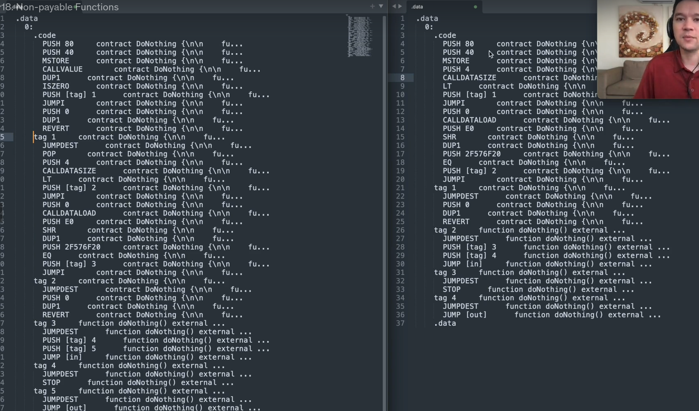

When we looked at the do nothing function, I set it to payable because I said it would be cheaper in gas.

Let's see why that is actually the case.

So if I were to compile, let's let's do it without payable first.

If I were to compile this, deploy it and execute the function, **DoNothing()**.

I see that the gas cost is **21,186**.

Now let's add the **payable** portion and let's add the let's spell it correctly.

Add the payable portion and redeploy it.

So remember, it started off as 21,186 gas.

I deploy execute the function and we see that it is **21,162 gas** which is **clearly cheaper**.

**Why is that the case?**

Well, we already know that gas in execution phase can come from one of four places.

1. One is the **size** of the **transaction data**.
2. The other one is the **amount of memory** used
3. and the **amount of storage** used
4. and the **opcodes** that are **executed**.

We can look at the transaction data that was sent over here and see that the function selector is going to be the same in both function calls.

Obviously because the function name didn't change.

So in both cases we sent **0x2F576F20** as part of the function called because we were trying to say execute the do not do nothing function.

And you can see that as part of the up codes that I've copied over here.

And we can look at these up codes and see where the difference is coming from.

So I've copied over the **OP codes** from the non **payable case on the left** and the **payable case on the right**.

Already you can see that the **payable case has fewer opcode**, so it shouldn't be surprising that it costs less gas.

But let's see what's actually happening.

We see both functions start off with the useful `PUSH 80`, `PUSH 40`, `MSTORE` situation and
- in the non payable case we see that it's looking for the call value first and
- in the payable case it's just looking to make sure that there are four bytes inside of the call data.

**So why is it looking for a call value ?**

Well, in a in the **non payable function**, it's going to revert if you send ether to it.

So it's going to check that.

Well, did you send zero ether?

If so, that's fine.

Let's continue on with the **regular execution** and see that you sent four bytes.

But if this **isn't zero**, then it's going to **revert**.

Let's see that in action.

So if I put a non payable function over there, deploy it and send some ether with the transaction and do nothing.

It reverts.  That's what we see over here.

**This is the revert code that's causing it because we sent a non-zero amount of ether in the payable case.**

It doesn't matter how much ether we send so I can send zero ether.

It will not revert.

Or I can send one ether and it still does not revert.

That's the point of this course.

I don't want to just tell you that payable functions cost less gas than non payable functions.

I want you to have a mechanism and a framework for understanding why that is the case.

But once you have the fundamentals, it's very easy to understand why payable functions are cheaper than non payable functions.