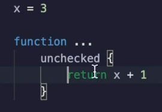
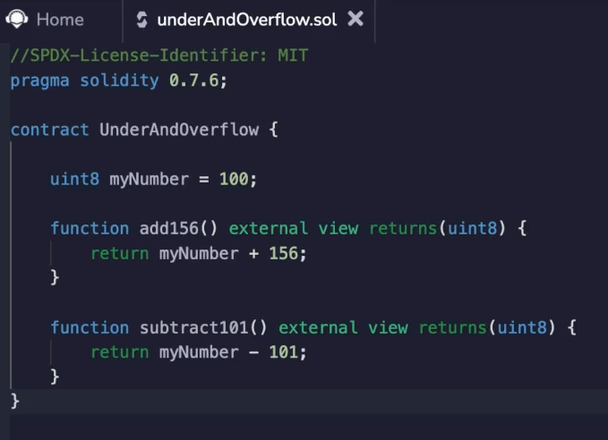

In an earlier video, I put some code inside of an unchecked block saying that it would simplify the app codes.

That was when we were reviewing that smart contract that looks something like `X = 3`, and then it had a function which returned `x + 1` and I put it inside of an `unchecked` block like this.

In this video, I want to understand what the significance of this unchecked block is and why it exists and why it simplifies the app codes and can be useful sometimes.

**Prior to solidity 0.8.0.**

There was a **security vulnerability** inside of you.

If you added numbers to bigger than what their representation could hold, it would spin around the number zero.

So if you are using a UN eight number, it stores eight bits and that means it can't store a number bigger than 255.

So an eight bit number would represent zero.

This way it's all zeros and one would be represented like this.

Three would be represented like this and a seven would be represented like this and so forth.

The biggest number you can get out of this is 255.

That's when all of the bits are set to one.

So what happens if you try to represent a number bigger than 255?

Well, if you were using maybe something like you in 16 or 32 or something much bigger, then if you start with 255 and add one to it, then it would just simply set the more significant bit to one and put the following ones to zero.

Okay, no surprises there.

But that can't happen when you're limited to a fixed number of bits.

And bits intrinsically have to be fixed because you can't store an infinite number of bits on a computer.

So what will happen when we add 100 to 156?

That's going to try to represent a number bigger than 255.

So prior to solidity **0.8.0**, what would happen is it would **overflow**.

So we get a zero back over here because behaves as if it was adding a more significant bit at the end and flipping the rest to zero.

But this significant bit over here doesn't fit inside of eight.

The same thing happens in the opposite direction.

If we start with 100 and subtract 1 to 1, then you can't represent negative one with an unsigned integer.

So it's going to spin back around and become 255.

So these are clearly wrong and can lead to unexpected behaviors inside of a smart contract.

**How do they fix that in solidity 0.8.0 ?**

It is to check if the outcome makes sense.

So whenever you add a number, it should always be bigger than the original term you are adding it to.

And when you subtract a number it should always be smaller.

So using that check, well, I have to change the compiler version.

Excuse me then.

At the bytecode level, the smart contract can detect if something funny happens.

So when I **compile** this in **0.8.0** and I **deploy** this new contract and I **run it**, it actually doesn't give me a return value back because it **reverted**.

This transaction has been reverted to its initial state.