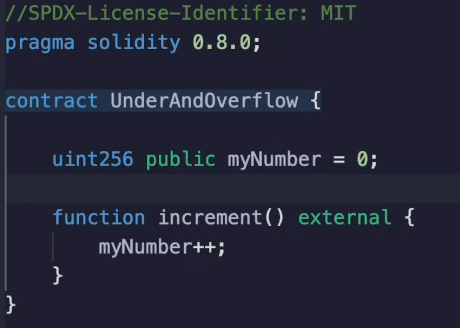
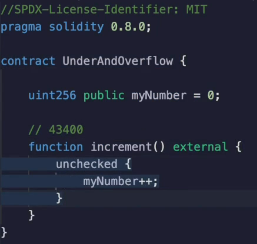
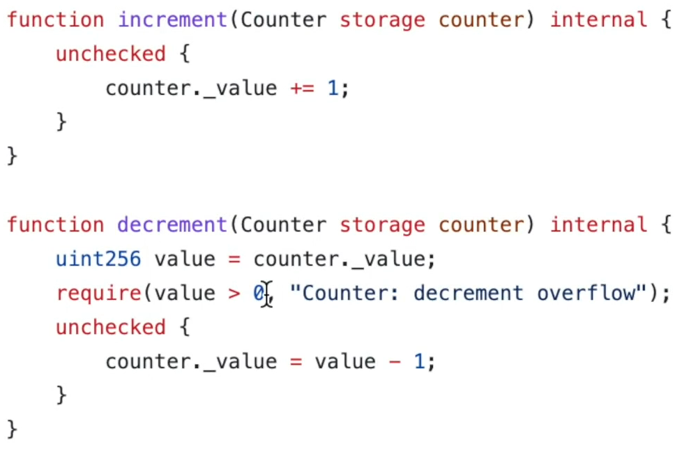
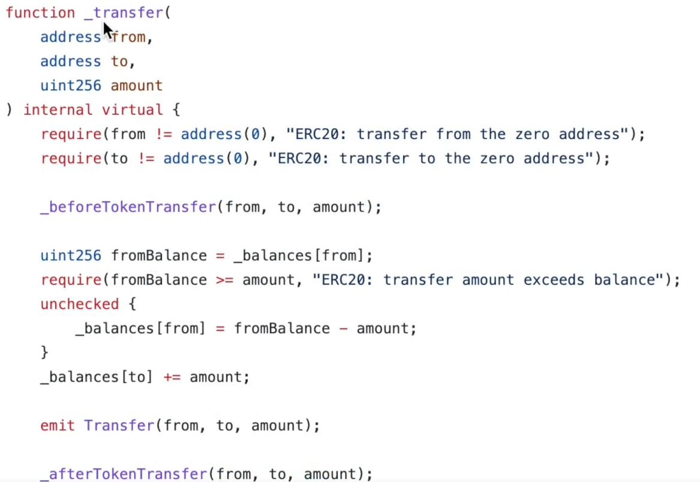

A natural question to ask is.

**Unchecked blocks introduce a security risk because of under flow and overflow.**

Why would you ever use them?

Well, that's a good question.

Most of the time it's not a good idea to put your code inside of an unchecked blocked.

**But sometimes the logic of the contract and the nature of the number you are using actually makes it make sense.**

First of all, let's look at it from a gas perspective.

I've created a contract here that's just going to take a number and increment it every time I call the increment function.

When I call **increment()**, I'm going to see that the gas cost is **43,400 gas**.

What will happen if I put this inside of an unchecked block ?

I'm going to delete the old contract, make sure this is compiled, deploy this and hit increment again.

In this situation, I see it has saved me a little **over 70 gas** because now the cost because rather than being **43,400**, now it's **43 323**.

Okay.

Why did that save the gas here?

Well, let's look at the op codes to get a clue.

I'm not going to step through them, but it will be pretty obvious this is the unchecked case and I'm going to copy the assembly code and put it in this text file and then I'm going to recompile this code without the uncheck block.

Get the compilation details.

Copy the assembly code and put it in another file.

So in this file, let's just to simplify things.

Let's remove the constructor portion of the codes over here and over here we can see that there are **98 opcodes**.

And over here we can see that there were **133 opcodes**.

So **those extra opcodes** that are called during the execution portion are going to **increase the gas costs**, which is the difference that we see inside of the measurements.

Those extra up codes are **checking**.

Does this number post the addition operation makes sense? Whenever you add two numbers together, the result should be bigger than either one of the terms of the addition.

Right?

And if that's not the case, then you know that an overflow has happened.

So that's what's getting compiled into the smart contract when you are using counters.

This is actually the most common case to put code inside of an unchecked block because the likelihood of overflowing a **256 bit number** is pretty much close to zero because to do that 256 is is **bigger than the count of all the atoms in the known universe**, which is roughly ten to the 80.

So you're not going to be able to call the increment function enough times in order to actually cause that overflow.

There's there's not enough time.

There is not enough money to pay for all of that gas.

So you can see that in something like the **Open Zeppelin counter library** where they provide the counters that you can increment decrement a reset, and they know that if you're starting at zero that you're not going to be able to overflow.

Now, if I had started this at something much closer to the **maximum value of two** to the **256**, then there could be an **overflow possibility**.

**But if it's initialized to zero, you're not going to be able to increment enough times for that to happen.**

For the **decrement()** case, they had a **check** beforehand, before they decrement.

They want to make sure that, well, you're not doing zero minus one now because you're always documenting in units of one or adding in units of one.

You know you're safe.

If you were adding much bigger numbers, you would need to put some thought into it to make sure that your starting value and your n value are **not close to the boundaries** of **zero** or the **decimal number corresponding** to all **256 bits set to one**.

The other situation you can see an unchecked block in is inside of the Erc20 implementation from Open Zeppelin.

When someone initiates a **transfer from one address to another**, they need to subtract their balance and add it to the recipients.

But you know that **you cannot transfer more coins than what you own**.

This require statement says that the amount that you're sending needs to be less than your balance.

So if **I have 100 coins**, I **can't send you 101 coins**.

So because of that, you know that you're never going to subtract in such a way that you result in a negative number and **you can put it inside of an unchecked block** to save some gas.

Open Zeppelin doesn't put an unchecked block around the increment part because they don't know if you did something stupid.

Like initialize everybody's balances to be almost the limit of the maximum value that can be stored in 256 bits.

So they need to keep the safeguard here.

But if you were building an ERC 20 like contract and you knew that you initialize the supply to be such that no one address could ever overflow and it's not possible to get more coins, then you would be able to put this inside of an unchecked block too.

So **unchecked** is a **quick way to save gas**, and it's also a **nice way** if you're trying to **debug opcodes** and see where gas costs are coming from because it gives you fewer things to look at.

You just need to make sure that the constraints of your program and the surrounding require statements, eliminate the possibility of an overflow or under flow happening.