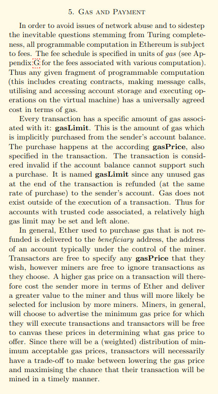
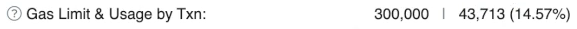
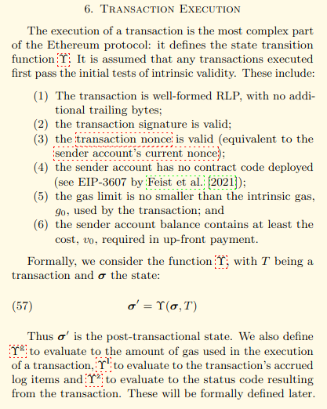
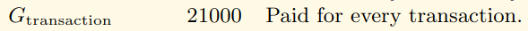
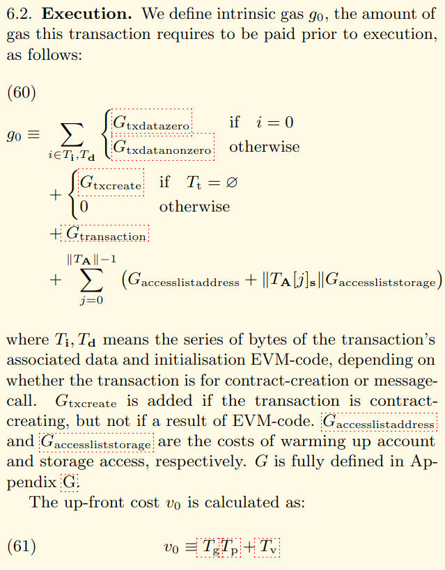

In this video, we're going to revisit the gas limit that we breezed through in an earlier video.

I said the gas used by the transaction is the relevant part to computing the cost of a transaction.

**But what exactly is meant by the gas limit ?**

In this situation.

I'm going to go off the script a little bit and actually read you the relevant part of the Etherium Yellow Paper.

I don't want to make this course something where I'm just going through the yellow paper and explaining all the sections about gas.

But the part where they describe it is actually pretty relevant.

And it's also a good segue way for us to talk about why the number **21,000** keeps popping up in Section five of the Etherium Yellow Paper.

https://ethereum.github.io/yellowpaper/paper.pdf

On page eight, it says `Every transaction has a specified amount of gas associated with it: Gas limit.
On page eight, it says `Every transaction has a specified amount of gas associated with it: Gas limit.`

`This is the amount of gas which is implicitly purchased from the sender's account balance.`

`The purchase happens according to *gasprice*, also specified in the transaction.`

`The transaction is considered invalid if the account balance cannot support such a purchase, it is named *gasLimit*, since any unused gas at the end of the transaction is refunded (at the same rate of purchase) to the sender's account.`

`Gas does not exist outside of the execution of the transaction.`

`Thus, for accounts with trusted code associated, a relatively high gas limit may be set and left alone.`

So the gas limit is how much you set aside to complete the transaction, but this is how much gas that was actually needed to complete the transaction.

If you set a gas limit that is lower than the gas used, then the transaction will revert because as you are stepping through each of the up codes, your gas is continuously decrement it and at some point

if you had zero, then it stops. **Why does this number even need to exist?**

Well, remember, the nodes in the Ethereum network cannot look at a transaction and instantly compute how much gas it's going to take.

They have to actually carry out the transaction in order to see how much gas it's going to take and them carrying out that transaction takes work.

So it's much more straightforward if the customer says, Hey, look, I know in advance how much this

transaction is going to cost in terms of gas.

So here's the limit I'm providing and I'm allocating this much Etherium in my account **to make sure that i can actually pay for it**.

And you can carry out the computation.

And if it goes below zero, then we'll get an out of gas error this accounting to make sure that the customer actually has enough Ethereum in their account to even reach the gas limit is one of the reasons that all transactions need to cost at least 21,000 gas.

Here's the relevant part of the yellow paper on the same page.

The execution of a transaction is the most complex part of the Etherium protocol that defines the state transition function.

It is assumed that any transactions executed first pass an initial test of intrinsic validity.

These include :

1. The transaction is well-formed LP with no additional trailing bytes.
2. The transaction signature is valid,
3. The nonce as valid.
4. The sender account has no contract code deployed.
5. The gas limit is no smaller than the intrinsic gas zero used by the transaction
6. And the sender account balance contains at least the cost V0 required in upfront payment.

So the first part checks.

- Okay is this is Ethereum transaction just containing nonsense?
- Okay, this requires some execution.
- Then you want to make sure that the signature coming from the private key is checking out with that 20 byte string. That is the hash of the address.
- The nonce is associated with every transaction.

So if I send you some Etherium, there's without a nonce, you would be able to take that transaction and replay it back to the network and withdraw more.

Etherium From my account, and that would be bad.

So rather than just saying, I'm going to send Alice five Etherium, I'm going to say I'm going to send Alice five Etherium and this is the fifth transaction I've ever done.

And that nonce, that number five, is recorded in the blockchain state.

So if Alice tries to take that and sends it again, the number I can see, oh, this five has already been used.

This is not a valid transaction.

Okay, so all of this work requires some computation, which is why we keep seeing the number **21,000** coming up.

**It's supposed to cover all of this**.

In fact, you can see that on the Etherium specification on page 28, excuse me, page 27.

And over here it says the transaction is 21,000 paid for every transaction.

**So that covers the cost of the six things that we talked about earlier**.

Now, I could have earlier said, okay, every transaction costs at least 21,000 because Ethereum says so, but I don't think that's enlightening.

But after you have some intuition about a theory from really digging into it, then the yellow paper actually starts to make a lot of sense.

You can see it inside of the math for the execution costs.

So the execution cost is the transaction data.

Remember, we had to account for that when we looked at the function selector.

We have to pay extra guess if we are creating a smart contract, which we aren't, but then we also have to pay that 21,000 that we will always have to pay.

We'll talk about access lists later, but this is talking about storage costs, which is something we will get into a later section.

But this is why I can keep subtracting 21,000 out of the computation in order to get a sense of how much these other costs are contributing to the transaction fee.
