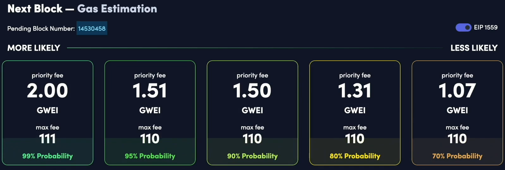

When we started this course, we talked about the gas price being something that's fixed in a constant, but that's not quite the case with **IP 1559**.

So it's helpful to understand it so that when you're computing gas costs, you're not surprised when the numbers don't line up.

**So what's special about IP one five, five, nine?**

- Well, **prior to IP 1559**, it used to be the case that the entirety of your gas fee would go to the miner post IP 1559.

- A portion of your transaction fee is now burned and not received by the miner, and the miner only receives a portion of it.

Now IP 1559 is pretty confusing because depending on where you look, you're going to see different terminology describing the same thing.

Sometimes you might see :
- a max base fee,
- a base fee,
- a max fee,
- a priority fee.

And we can see that.

Let's say if we look on **Etherscan** here, we see a base fee and a priority fee.

But if we look at **Metamask**, we will see a option to set a **priority fee** and a **max base fees**.

If we look on another gas tracker website ([**Ethereum Gas Estimator**](https://blocknative.com/gas-estimator)) we're going to see **priority fee** and **max fee** and **no base fee** anywhere.

Okay. That's pretty confusing, isn't it?

If you really don't want to get into this, all you have to remember is that the gas price per gwei is always less than or equal to the max fee with no mention of priority because the **priority fee on the max fee are not the same**.

**`Gas Price per Gwei <= Max Fee`**

But don't worry, there's actually only three entities that you need to worry about.

Here are three variables.

- Max priority fee per Gas
- Max fee per gas (?)
- Base fee

One is **max priority fee per gas** and **max fee per gas**.

So if we look at the actual specification [EIP-1559: Fee market change for ETH 1.0 chain](https://eips.ethereum.org/EIPS/eip-1559#specification) over here, we can see that an **IP 1559 transaction** is going to have **two components** to it.

One is the **max priority fee per gas** and the other is **max fee per gas**.

Now when we're trying to initialize the transaction from, say, **Metamask**, we can see what those are here.

**The max fee per gas** is actually the max base fee and the **priority fee** is max priority fee per guess.

**Now that might be confusing, but if you see the word priority inside of the variable, you know, it's referring to the max priority fee per gas**.

All right. That was really hectic.

And now we have a third one that we're going to look at.

There's also something separate to this called the **BASFEE**. This is defined by the protocol, and it's not a part of what you put inside of your transaction.

Let me just try to define this really quickly at a high level and then really dive into the details next.

1. So **Max fee per gas** is the **most gwei per gas** you are **willing to pay**. Independent of this other variable max priority fee per gas.

2. So **Max priority fee per gas** as a **subset** of **Max fee per gas**. This is how much the miner might receive and base fee is how much is definitely going to be burned.

3. The **BASEFEE** is determined at the protocol level.

So whenever you look at an Etherium block like here's **block 14526837**,

You can see the **base fee** as part of the header that would be over here, over here at **64 gwei**.

So every transaction inside of this block has to burn 64 gwei per gas.

And that's what you're going to see if I just look at one of the transactions here.

Here we can see 64 gwei again and that's how much it burned.

Now **the algorithm for computing it is done on the basis of how full or empty the last block was**.

So over here, this **block was full**.

It was using up **100%** of its **30 million gas** target.

So the algorithm roughly states that
- If it's full, increase the base fee by **12%**
- If it was empty, decrease it by **12%**

Now, of course, it's definitely more complicated than that.

If you want the actual specifications for that, it's this algorithm over here, which I am definitely not going to step you through.

So our 12% heuristic is good enough for now. Let's see that in action.

We saw that this block was full, so we expect that the next block is going to have a base fee that's **12% higher than 64 GWei**.

So if I put in **64 times 1.12**, I should see the next block having a base fee in the **vicinity** of **72**.

And that's what we see here. **72 Gwei** over here.

The block was fairly empty, so we should see the base fee drop by roughly 12%.

So let's multiply this by 0.88 and it should come back down to 63 Gwei **okay with 68 Gwei** because the block was not quite empty, but you kind of get the point by making **the base fee fluctuate with the amount of network usage** that's intended to stabilize the transaction fees rather than it being purely determined by auction.

Because this is inside of the actual block, you can access it with the `block.basefee`, basically **global variable** inside of **solidity** if you're using version **0.8.7** or higher.

Like I said, the base fee is determined by the protocol, but you can specify something that kind of looks like the base fee.

When you are initiating a transaction, which is the **Max base fee** over here, other people might refer to it as the **Max fee**.

And over here on **Etherscan**, it actually doesn't tell you what max fee is.

People have been specifying.

Okay, in order for your transaction to go through **your max fee** needs to be **bigger** than the **base fee**.

**Max Fee >= Base Fee**

What that ensures is that you actually have enough ether ready to be burned in order to put the transaction through.

But you notice that the base fee changes with every block.

**So that's why you need to generally specify a max fee that's higher than base fee with some margin of safety**.

Because if the next block has a higher base fee, then your transaction fee won't be high enough.

That's why I was able to say earlier that the gas price.

Gwei is less than or equal to the max feat.

Now, **if your max fee is bigger than the base fee** and we'll talk about how the priority for you will influence this in a second, but **the difference between those is refunded to you**.

So that's why we can say gas price per gwei is less than or equal to the max fee.

You can actually see all three variables at play when you try to use the advanced gas fee feature of **Metamask** over here it's saying recently the block basically has been **around 40 Gwei** (41.56)

So if I put in something like **100 gwei**, it's going to say the max base fee is **higher than necessary**.

That's because it's really unlikely that the BASEFEE is going to climb from 36 to 100.

But if I specify exactly **36**, then it's going to say the max base fee is **low for current network conditions** because there is a very real risk.

Well, let's say **37** because technically it's **36.7** here.

But even though I have specified a max base fee larger than **36**, this is cutting it to close.

There's a good chance that my transaction won't go through unless the BASEFEE goes down in the near future.

And even as I'm recording this, I can see that the base fee has increased.

So if I had specified **37**, it's definitely not going to go through.

But if I specify it at something like **50**, then there is a margin of safety and Metamask thinks, okay, this transaction is going to go through.

Now let's discuss the priority fee.