Now let's talk about the priority for you.

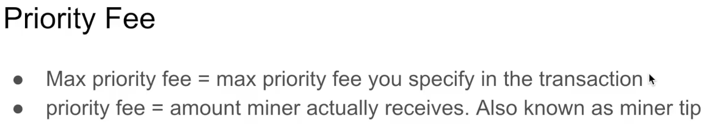

Unfortunately, there is a bit of a misuse of terms between the **METAMASK** and the actual **EIP specification**.

When you are creating a transaction, you can specify the **max_priority_fee_per_guess**.

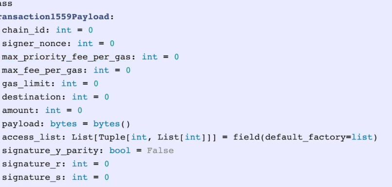

However, the max priority fee is **not** actually **equal** to the priority fee.

- The **max priority fee** is the most that you're willing to give to the miner out of what's left
- When the **max fee for a gas** is subtracted with the **base fee**.

So when I specify a transaction here and let's make the max base fee five, I'm saying up to 1.5 of this.

These great progress can go to the miner.

**Metamask calls this a priority fee**, but this is actually **Max**, what do they call it here?

But this is actually **max priority fee per guess** in the **specification**.

Oh, well, sometimes this is known as a **miner tip**. So this is **what the miner will get**.

Now, let's let's see the math here.

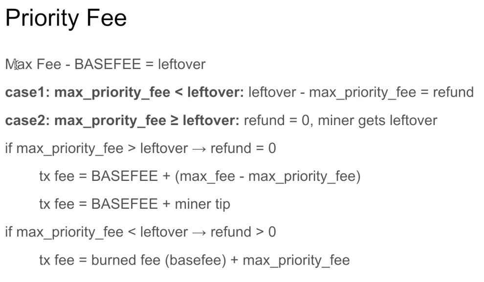

As I said, when you take the max fee, subtract the base fee, you get what's left over.

Now, there are two things that can happen.

What's left over is greater than the max priority fee.

And in that case, let's look at that thing I was doing in Metamask earlier.

We had **five** specified as a **max fee**.

Let's say that **the base fee was three**.

That means we're going to have to gwei per gas left over.

Now the **miner can take up to 1.5** out of it based off of the values I was putting.

And that means the **refund** will be **0.5 gwei for gas**.

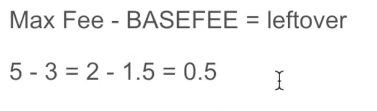

We'll look at some more examples here.

You can see the two situations.

One is where the max priority fee is less than the left over.

So here the max priority fee is less than the left over.

So a refund is issued to us.

But let's say that the max priority fee was actually greater than the left over.

So if the base fee was four.

This would be one.

And you can't get a negative value here.

But what would happen is the miner would only get one gwei and then there's no refund.

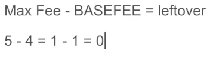

Okay, let's see this with pictures.

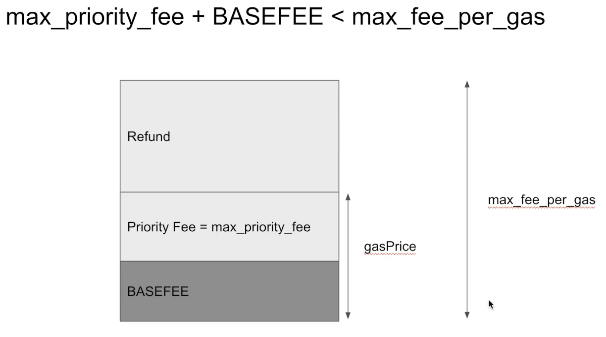

You specify the max fee per gas and this is the most you are possibly going to pay if the base fee plus the max priority fee is less than the max fee per gas.

This is the gas price you will pay and a refund is issued to you.

And the other situation where the base fee plus the max priority fee is greater than the max fee per gas.

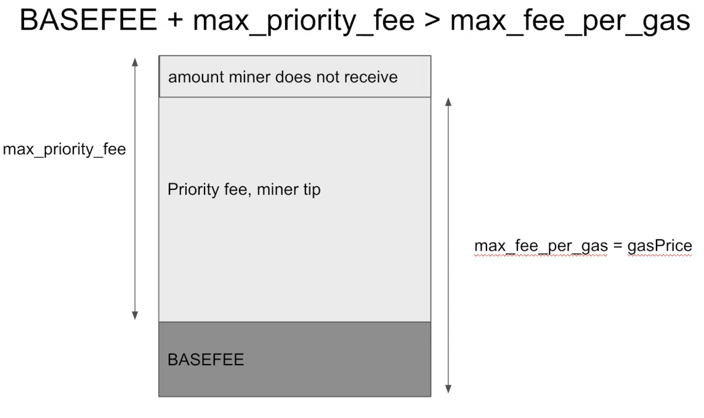

Then during the execution, the miner will get the priority fee, which is less than the max priority fee, and the base fee is burned just the same in either transaction.

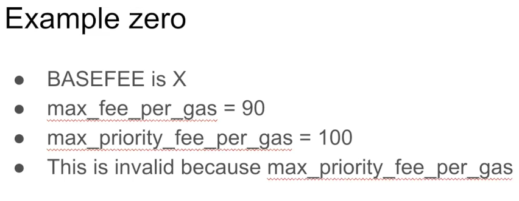

As we said earlier, if you enter the values like this, it's not going to work.

So let's do that in matter, Max, to see this failure in action.

If I specify a **max base fee** of **four** and a **priority fee** of **five**, then it's going to yell at me because **the max base fee cannot be lower than the priority fee**.

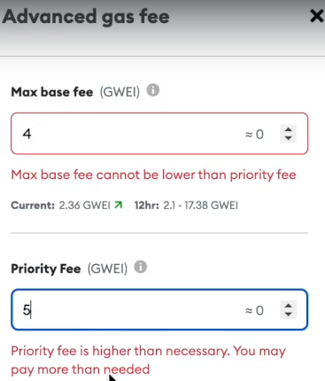

The priority fee is a subset of the max fee.

Okay, if the base fee is zero, which would never be the case.

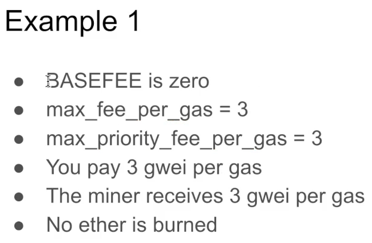

But let's say it was if the **base fee** were **zero** and the **max fee per gas** is **three**.

The **max priority fee per gas** is **three** than the miner is going to take up the entirety of the max fee per guess.

Right.

Because you said the miner can take up to three, but the most you're willing to pay is three.

And since the base fee is zero, the miner is going to take all of it.

Here's a more realistic example.

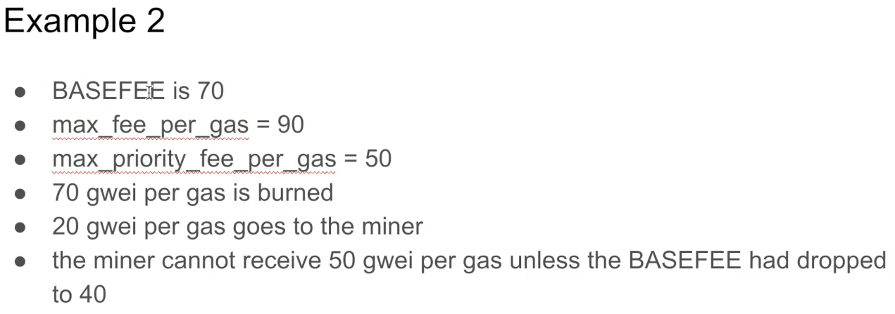

If the **base fee** is **70**, **70** will get **burned**, and if the **max fee** is **90** after the burning **20 will be left**.

If you say the miner can take up to 50, well, the miner can't take 50 because only 20 is left.

So the entire 20 will go to the miner and you will not get a refund.

The only way the miner could have actually received this full amount is if the base fee had been 40, in which case 90 -40 is 50.

Let's look at the refund case.

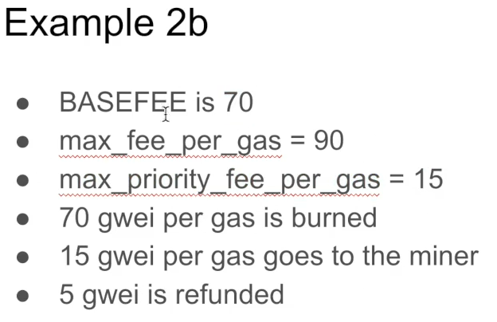

If the **base fee** is **70** and the **max fee per gas** is **90**, what's **left is 20**.

But if we had said the miner can only receive up to 15 gwei per gas, then **15** will be given to the **miner** and **five** will be **refunded** whenever the miner has the option to.

They're always going to take as much of the max priority fee per gas as possible.

And let's look at this case.

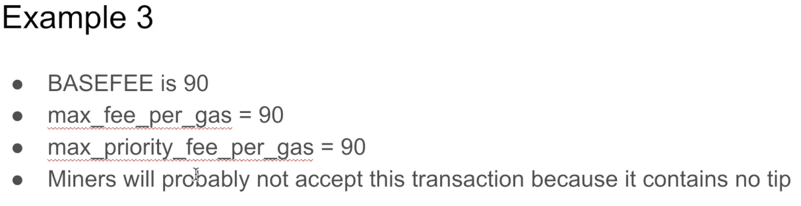

This one's a bit of a corner case.

If the **max fee per gas** is **90** and the **base fee** is **90**, then there's **no way for the miner to receive a tip**.

It doesn't matter how much you set the max priority fee per gas to in this situation, the miner is won't accept the transaction because they want to be paid tips.

Okay, here's the conclusion.

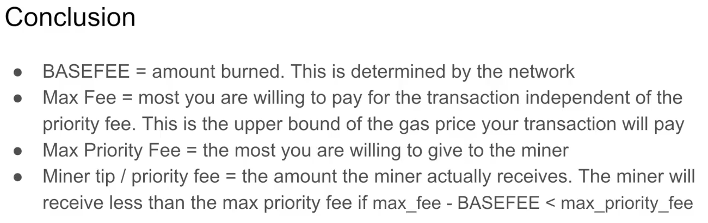

The base fee is the amount burned and this is determined by the network.

This is independent of what the miner wants and what you put inside of Metamask.

The max fee is the upper bound of your transaction cost.

So regardless of what you set as the priority fee, you know the most amount of Etherium that is going to leave your account as a result of the transaction fee.

The max priority fee is the most that you are willing to pay to the miner.

Most of the time the miner will receive the full max priority fee.

But if the base fee is very high relative to the max fee, there won't be much fee left for the miner to actually receive.

And in that case, the actual priority fee they receive will be less than the max priority fee.