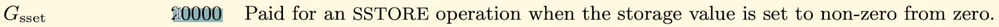
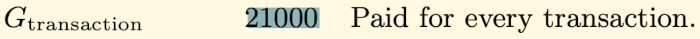
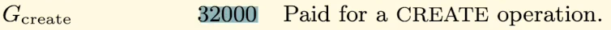
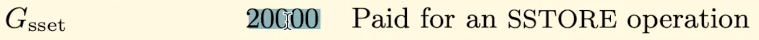
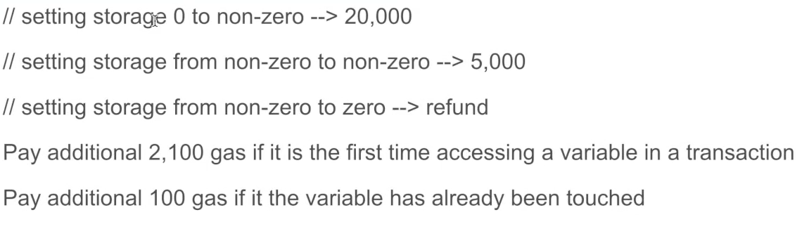
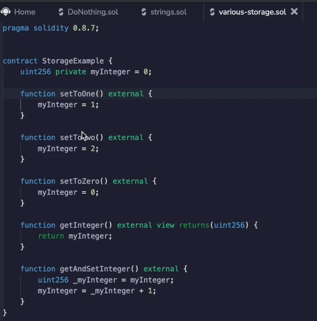
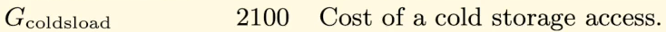
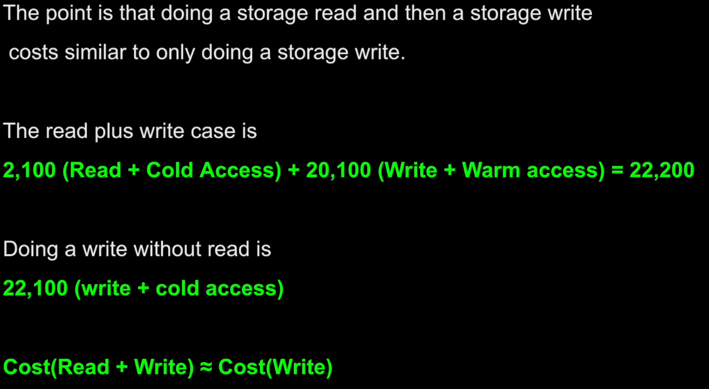

Now let's try to understand the gas costs associated with storage.

This is probably one of the most important videos inside of this course.

So definitely make sure that you understand it, because when you look at the gas cost of storage from the **yellow paper**, you'll see it costs an order of magnitude more than almost everything else.

https://ethereum.github.io/yellowpaper/paper.pdf

So this is a **`sstore` opcode** that we looked at.

The other ones that cost a lot are, for one, initializing a **transaction**

and for **creating a smart contract**, which you can imagine is expensive.

And you probably know that by experience, storing variables inside of storage is a frequent operation.

So it's one that we want to manage carefully.

- When you **set** a **storage variable** from **zero to non-zero**, it's going to cost **20,000** in gas **plus extra cost** that I'll discuss in a little bit.

- When you are just **changing the value**, it costs $5,000, it costs **5000 gas**.

- And when you are **setting** the **storage** from **non-zero to zero**, you actually get a **refund**.

**Now, why would Ethereum be programmed like this?**

Well, let's think about it.

When you are **storing a non-zero value**, that's something that all of the nodes need to keep track of and it could possibly be stored for forever.

Right.

So that's designed to disincentivize people from abusing the storing values because as **Ethereum has zero by default** inside of its variables.

So you actually don't need this.

This is perfectly valid too.

**So if this has never been set before, Ethereum doesn't need to index this value, it just returns zero by default**.

This cost is still expensive, but it's quite a bit less than setting it from 090.

Well, why is this?

Well, this has already been indexed, so there is already a tracker for this.

And when you set storage from zero from non-zero to zero, well, that's one less thing that all of the Ethereum state needs to keep track of.

So they want to reward people for setting variables to zero.

Okay, now let's see this in action.

I am going to just clear and deploy this so you can see this from the get go, compile, deploy and this is set to zero as I was discussing earlier.

Let's **`setToTwo()`** now.

And when I run this transaction, I see it cost me **43003 gas**.

Well, let's do some math, shall we?

That will be **`43003 - 21000 (for the transaction) - 20000 (for setting the storage variable from zero to non-zero)`**.

And we still have an extra **`2000 gas`** here.

We know that the extra costs from doing nothing are on the order of the few hundred, a couple hundred gas at most.

But over here it's a **whole 2000**.

So where is this coming from?

Well, that is this over here.

When you **access** a **storage variable** for the **first time** in a transaction, you have to pay a **cold storage access fee**, which is what it's called here.

Inside of the other paper, **`coldsload`** is **2100**.

So if we look back at the calculator again and subtract away 2100, now we're back in the territory of these are just all of the extra costs that are associated with calling any function, even if they're empty.

Okay, now let's look at the other situation setting **from non-zero to non-zero**.

We already have it set to.

So let's **`setToOne()`**.

If you set a storage variable to the same value, there's a separate cost with that, which I will get into later.

Over here we see it costs **26224** and we subtract **2100** and it costs a little **over 5000 gas**.

This is actually including the cold storage access I talked about earlier.

Let's try to understand this aspect a little bit better now.

If I do a **`getAndSetInteger()`** over here, I'm doing a **cold storage access**.

So actually we can actually demonstrate just the cold storage over here where we're only reading the variable, we're not writing it.

So if I do **`getInteger()`** and look at the cost, then I'm paying **23335 gas**.

So that's **21,000 for the transaction** plus **2100** for the **cold storage access** that comes out to 23,000, which is exactly what we see here.

But if we do this ( **`getAndSetInteger()`** ) this **won't cost 2100** for the **cold storage** and then **2100** again for the **cold storage** and then *20,000* for setting it **from zero to non-zero**, if that's what in fact we are doing.

Because this **second access** is **not a cold access**.

So we're only going to be paying **100 gas in that situation**.

And you can look that up in the yellow paper, too.

Okay.

So first, let's set it to zero just to make all those numbers nice and then let's call, get and set.

And sure enough, it's **43,000** because the **extra warm access** after this is much **cheaper**.

You can see that this cost of **43,000** is quite similar to just going from **0 to 1 43,000** again.

Right.

Because this extra 100 gas is relatively small compared to the 20,000 gas of setting from zero to non-zero.

So when we go **from zero to non-zero**, the **first time**, we have to pay the **storage access** and the cold storage costs, whereas over here we pay the **cold storage access** and just the storage costs.

