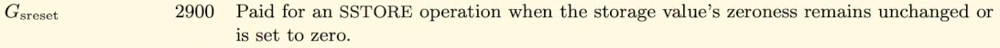
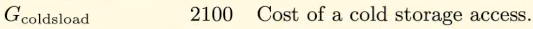
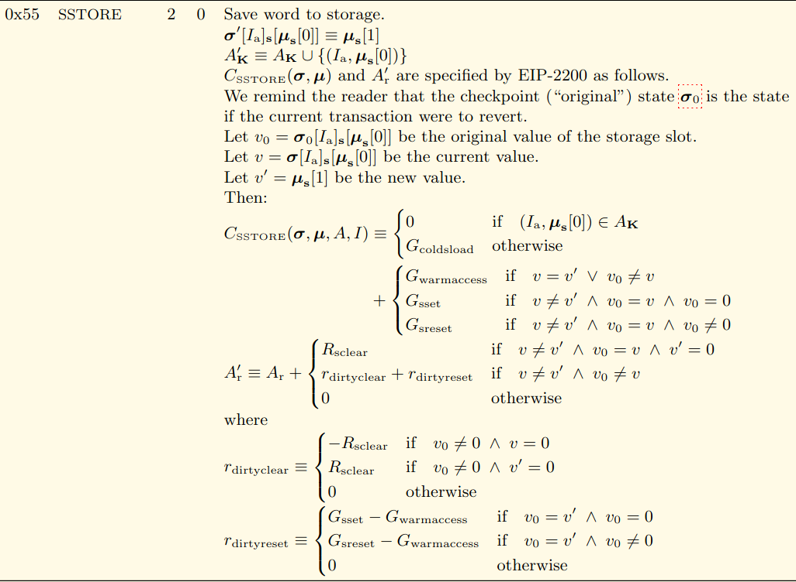
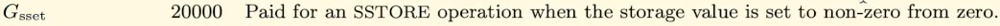

In this video, we're going to look at where exactly the 5000 gas is coming from when you **change storage value** from a **non-zero to a different, non-zero value**.

Interestingly, if you look through the **[Ethereum Yellow Paper](https://ethereum.github.io/yellowpaper/paper.pdf)**, you're not going to see a mention of **5000 gas** for that situation anywhere.

Over here, we have different gas costs for different operations when we're dealing with storage and other things.

But 5000 is not one of those numbers.

And you can search the yellow paper.

It's not there, but you can actually see the formula where that is derived.

The two relevant numbers are `Gsreset` and `Gcoldsload`.

So `Gsreset` is paid for in a store operation when the storage values zeroness remains unchanged or is set to zero.

When we go **changing a storage value** from, let's say **5 to 6**, we expect to pay **5000 gas** for that.

So that's because it's **zero** and has **remained unchanged**.

It was non-zero in both situations.

The other portion of the **5000 gas** comes from `Gcoldsload`, **cold storage load**.

That's **2100 plus 2900** is, of course, **5000**.

The formula for that is on page 34.

If we look at this section, frankly, it looks like hieroglyphics

But luckily the relevant parts stand out.

We have to pay the **cold storage load** (`Gcoldsload`) **if it's our first time** accessing the variable and then we have to pay that **reset operation** (`Gsreset`).

And this operation cost **2900** gas plus **2100** gas is **5000 gas**.

That's also why we can see the storage costing **22100 gas** when we went from **0 to 1**.

If we go back to that page I was looking at earlier over here, we can see that the `Gsset` is **20,000** and that's **when** we go from **non-zero to zero**.

And you'll see a lot of material saying that asset costs 20,000 gas, which is true, but when you measure it, **it actually costs more**.

Well, that's **because if it's the first time accessing it, then we need to also pay a cold storage load (`Gcoldsload`) in addition to that**.

So let's go back to the formula and see that in action.

So we see we pay the cold storage load, which is 2100, and then we pay the gas set and we can see the initial value was zero.

That's why we are paying the 20,000 gas costs in the gas reset situation.

The initial value is not zero and that's the 5000 gas costs, which is the sum of the cold storage load and gas reset.