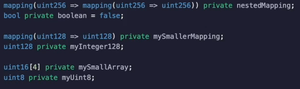
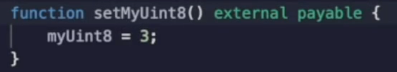
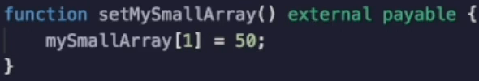

It's important to grasp that **all storage operations** are happening with **32 byte slots**, *even if you're using variables that are smaller*.

So I've added some more variables to our smart contract over here with smaller sizes.

So we have a **mapping** from **128 to 128** and **128 bit integer** over here, a **uint16 array** and a **uint8 integer** again.

I've already compiled and deployed this.

If I set.

Oh, this is unfortunate.

It's cut off over here.

Let's start with the update.

So if I use `setMyUint8()`, we're going to see it's going to cost **43320 gas** again.

So even though we were only supposedly **just changing a bits**, the reality is the operation is happening inside of a **32 byte slot**.

So let's use `setMySmallArray()`, which was you went 16 and over here it's **43329 gas**.

Okay, I could keep clicking through these things, but you get the point.

It's going to cost **43000 gas** because whether it's a **boolean** or an **address**, you went to **256** or a smaller, you went under the hood.

**It's just a 32 byte storage slot**.

