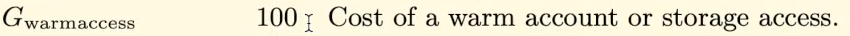

In this video, we're going to look at what happens in terms of gas costs when a storage value is set to the value that it already was.

So in this smart contract, my integer is set to one and we have a function that allows somebody to change that value.


So what happens if we set it to the same value over here?

We can see that the gas cost is **23570**.


We know that **21,000** comes from the **transaction**.

**2100** comes from the **cold storage access**.

**So how much is actually spent on the store operation?**

Well, we could pick apart the objects in the memory again, but that would be a rather long process.

There's a shortcut we can use here by looking at the actual cost when the store opcode was executed.

So if I debug this transaction, I can see at the relevant part when the function call happens, it's going to push zero out of the stack so that it can access this storage slot over here.

And that costs three gas and you can see the remaining gas decrement by three when it was executed.

Now, at the store operation, for some reason, Remax doesn't tell us what the cost is.

It says zero.

But if we pay close attention to how much the remaining gas decrements, we can see how much the actual

store operation cost us in the scenario where the value didn't change and when we execute it, if we

watch closely, we can see it decreasing by 2200, becomes 8639 and goes to 6439.

We know that **2200** is attributable to the **store operation** when the **value doesn't change**.

And we know that **2100** of that is from doing our **cold storage access**.


So this tells us that **not changing the value** costs **100 gas**.

So this actually gives us a bit of an **optimization we can use** depending on how our code is set up.

So imagine that we had already been reading the variable beforehand.

Suppose we had a statement like require my integer is not equal to 100.

So let's just say your application said after my integer is set to 100.


It can't be changed anymore.

Well, in that case, the cold storage access is moved out from this line and into this line.

**So what we can do is cache the value and run an if statement to see if it's going to change the value or not.**

**Let me show you.**

So if we do, .

```javascript
uint256 _myInteger = myInteger;
```


Now we pay **2100 gas** on this line over here.

We can check to see that it's not equal to 100.

Then we can add another if statement.

If my integer is equal to I, then that means we're not actually going to change the value.

So in that case we can just return.

But it would probably be more ergonomic.

If we do it like this.

We check that it's not equal to I and if so, do the update.

So this will avoid the 100 gas cost at the expense of paying for an if statement.

But it turns out the if statement is actually cheaper.


Let's deploy this new contract and test how much gas it costs.

And we see we have actually **saved 35 gas**.

That's pretty interesting, isn't it?

Because we added more code here and saved gas.

That's because they require statement.

If statement are pretty negligible in terms of gas, we'll review them at a later part of this course.

But that **100 gas** that we pay for **not changing the value** costs more than these **extra checks** and this read from `myInteger` to `_myInteger` takes the **2100 gas** cost of the **cold storage** out of here and puts it over here.

##### Just keep in mind that this trick will only work if the workflow of your code requires you to read the storage variable before writing it.

If you **read the variable** and put it into the **if statement** in order to **prevent writing the same value**, then you're still adding the extra cost of the if statement which won't save you gas if you happen to actually be changing the storage variable.

So if either your **code requires** you to **read the storage variable before writing it**, or most of the time you expect the integer to not be changed, then this trick **will save you gas**

**But otherwise** it may end up **costing more gas** if most of the time the **integer is changed**.

If we go back to that formula we were looking at earlier, we're going to see that we are going to pay `Gwarmaccess` because the **old value** is **equal** to the **new value** and how much is `Gwarmaccess` ?


Well, if we go back to that table that we keep looking at, we're going to see that it's **100 gas**.



And that's exactly what we saw in our Test in remix.