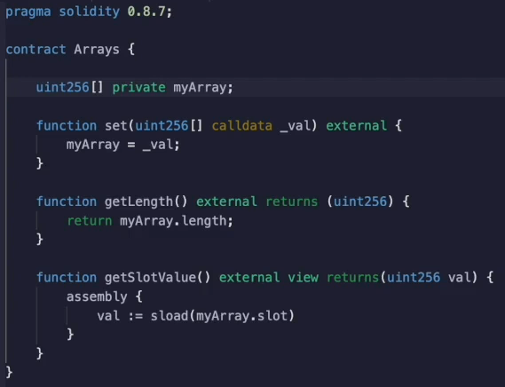
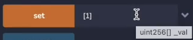
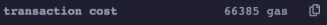
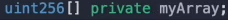
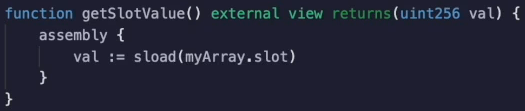

In this video, we're going to be talking about the gas costs of a race storage.

Now, arrays are quite a bit more complicated than the other data types we had talked about.

Let's see how they are actually stored.



And Etherium, over here, I have declared a **private array** that is **dynamic** in **length**.

```php
uint256[] private myArray;
```

When we set the value of the array `[1]`



Then we're going to see that the **gas cost** is **66385 gas**, which is **higher** than the **43,000** we had seen for setting other values.



So we can guess that there's another storage operation going on here.

It turns out there is.

So on
1. we are paying **21,000 for initiating the transaction**
2. we are paying another **22,000**

for storing that **one value** in the **first slot** of the **array** or the **slot 0**, depending on how you're counting.

And finally, we have another **22,000 gas** coming from **storing the length of the array**.

So, you can get the length of the array like this.


This is actually being stored in that storage location over here.



So if we get the **length of the array**, we can see predictably that it's equal to **one**.

If I **get the slot value**, what it's doing is it's just looking at **slot 0**, which is where this is



And you can see that it's returning the same thing of **one**.


 Let's set this back to zero and when I get the slot values, you see zero.

So this is storing the length and then you have to store the actual values of the array.

So let's do some more exercises to build up our intuition.