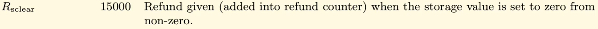
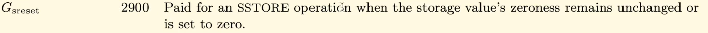
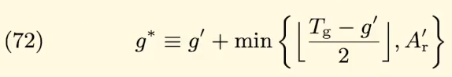
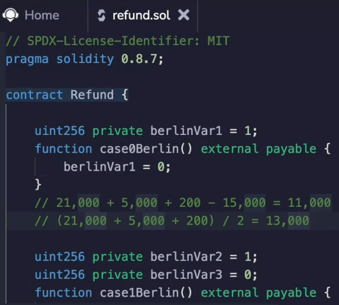
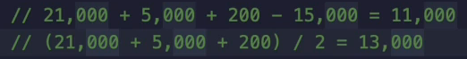
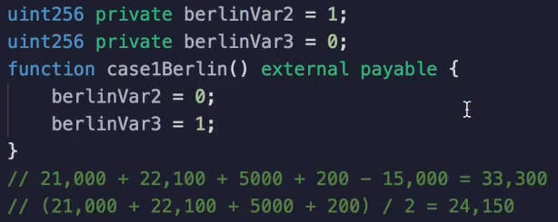
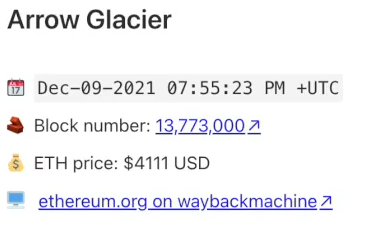
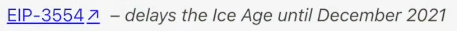
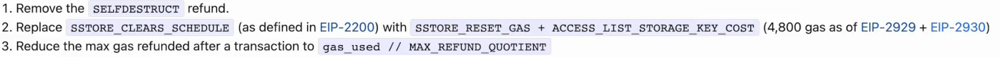
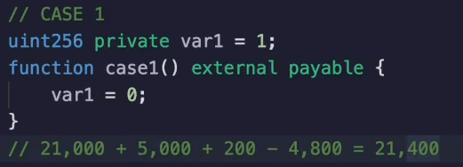

In this video, we're going to be discussing how gas refunds work in theory and when it comes to storage.

Now, this is going to be interesting because the **yellow paper is out of date** with the current state of Ethereum.

[**Ethereum Yellow Paper**](https://ethereum.github.io/yellowpaper/paper.pdf)

And I've checked the GitHub of Ethereum and for some reason the yellow paper has not been updated yet.

However, we still need to review the yellow paper in order to understand the overall strategy of Ethereum when it comes to refunds.

And then we will look at EIP 359, which brings us back up to date.

The most interesting thing here is `Rsclear`, which is a **refund** that you are given for storage when you **clear a variable** that is **set to zero**.

So this clear could be setting :
- An address from a **non-zero address to the zero address**
- Going from a **true to false**
- Going from a **non-zero number to zero**.

What this is, is a refund given or added into the refund counter when the storage value is set from **non-zero to zero**.

Now, this **does not mean** that the instant that you set a particular storage variable from **non-zero to zero**, you're going to get **15000 gas back**.

You **still have to pay that 5000 gas** when you **change the value** of that storage variable.

This is the same as if you had changed the storage variable from non-zero to non-zero.

Now remember, we still **had to pay that 5000 gas** in the scenario where we went from **non-zero to non-zero**.

That's true in the non-zero to zero case.

Also, here's **why**.

Because **we pay the 2900** for a **store operation** when the **storage value zero not remains unchanged** or is **set to zero**.

So when we set something to zero, **we still have to pay that 2900**.

And most of the time will be accessing that variable for the first time in the transaction when we set it to zero.

So we'll also have to pay the cold storage access of 2100.

There is a technicality here.

You were **not always able to get this full 15,000 gas and refund** in another page.

If we read through all of these formulas which you are certainly welcome to do on your own, but I will not do here.

You're going to get to this one.

And the explanation for that is the total refundable amount is the legitimately remaining gas g prime added to the amount refunded, with the latter component being kept up to a maximum of half rounded down of the total amount used the total gas minus the legitimately remaining gas.

**So you cannot get a 15000 gas refund if your transaction costs less than 30000 gas**.

So let's see that in action.

I'm going to compile this smart contract over here and run it on the **London version**, which is the version running now at the time of this recording, but to an earlier one called **Berlin**, which is what the yellow paper is reflecting.

When I deploy this contract and I call the `case0Berlin()`, which is where I take a storage variable `berlinVar1` and it has a value of **one** and I set it to **zero** inside of the function.

We're going to see that the gas we pay for this transaction is **13112**.

Now, where does this value come from?

Well, the total gas spent on the transaction is **21,000**, **5000 plus 200**.

Now, remember, that's **5000 comes from setting it to zero**, but that doesn't include the refund.

Now, we could get up to a **15,000 gas** in **refund**, but the sum of this is **26,000 and half** of that is **13,000**.

So we cannot get the full 15,000 gas in refund.

Otherwise we would get 11,000.

But 11,000 is less than half of 26,000.

Okay, what about Berlin?

Var two in Berlin.

Var three in case one Berlin.

Well, what I'm going to do is set this to zero and set this to one.

In this scenario, we'll be able to get the entire refund back because the total gas we're spending is more than 30,000.  The **total execution cost** is **33300**.

And where does that come from?

This is the transaction cost.

This comes from setting Berlin var 3 to 1 when it was originally zero.

And this comes from setting Berlin, var two from 1 to 0, and then 200 is for the extra stuff around the function call and we can get up to 15,000 gas in refund.

If we were to add up all of these values, it would normally cost us **48,000** and half of that is **24000**, so we could get up to a 24,000 gas refund.

However, we only get 15,000 for setting that storage variable to zero.

So that's why our gas comes out to **33300**.

Now, as we know, Berlin is no longer the latest version of Ethereum.

In fact, it's not London either.

We are currently looking at **Arrow Glacier**, which is at the top of this page, but nothing interesting happened here except for delaying the difficulty bomb, which seems to happen quite often.

Anyway, the interesting stuff happened in London and London is where we did another delay in the Ice age.

I guess that's how things roll around here.

But the interesting thing happens in **EIP 3529**, which reduces the gas refund for even more operations.

So don't worry, the concepts in the yellow paper were still correct, but the numbers need to be adjusted.

And here are the adjustments.

The first significant change that happened in the EIP is that you don't get a refund for **self-destructing contracts** anymore.

So there is actually quite little incentive to self-destruct contracts.

Now, with one minor exception that I'm going to talk about in the later video.

But you don't need to worry about that right now.

The next thing we're going to look at is the refund.

So this might look like gibberish and you can feel free to look through it on your own.

But this essentially replaces the 15,000 we were looking at earlier.

**So you can get up to 4800 gas and refund instead of 15,000 gas like it used to be.**

And the other thing is, remember how we said we could get up to half of the amount that we spent back as a refund?

Well, that's not the case anymore.

Now it is one fifth.

Okay, let us see these numbers in action.

The first thing, of course, that we're going to have to do is compile this against London and make sure that we're compiled, deploy it.

And let's look again at the original case where we said just one variable to zero, and that will be over here where we have var one, which is one, and we set it to zero.

Let's run case one and we see that the gas cost is **21400**.

How does this come out?

Well, the 21,000 hasn't changed.

The 5000 cost of setting a variable to zero hasn't changed.

This 200 hasn't changed either.

But **rather than subtracting 15,000, we're going to subtract 4800**.

And that's where we get the 21,400 gas from that we see over here.