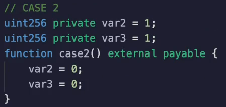
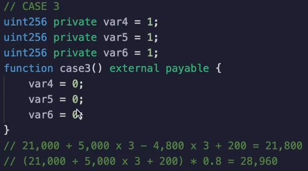
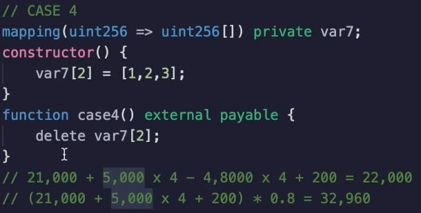
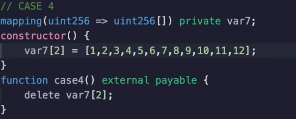
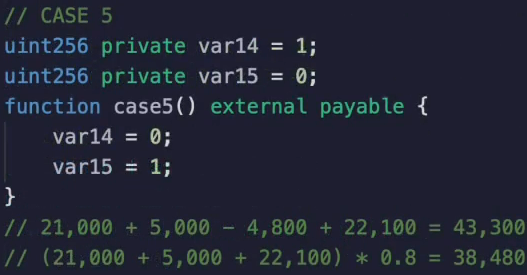
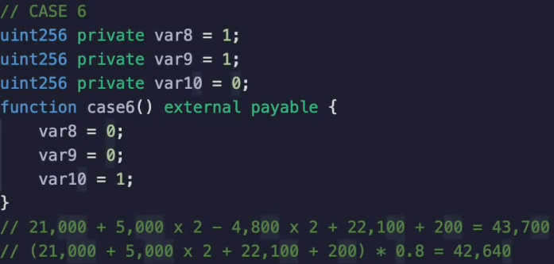
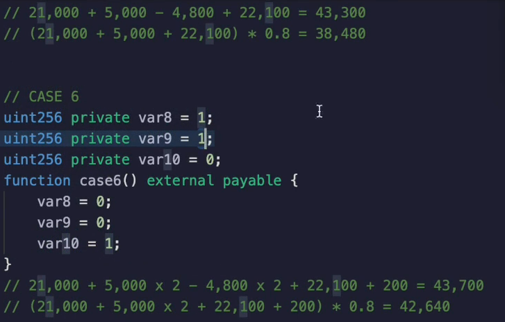
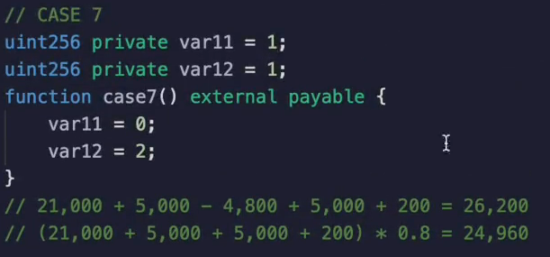
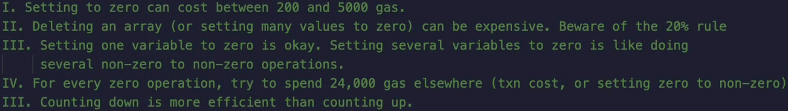

Now let's look at the cases where we are not able to get our full refund back and see what the implications of that are going back to the case earlier.

Our transaction cost was **21,400 gas**.

But if we look at the gas that we could have obtained, that is we had gotten the full 20% possible back.

We would have spent as little as 20,960 gas, but we didn't get this refund because we only got 4800 back.

**Well, let's set more variables to zero so that we get an even bigger refund.**

Let's run **`case2()`** and see what we get when we see, as predicted, that the gas cost is **2496 gas**.

That actually causes the price to go up, interestingly.

So when we look in this situation, we could say, oh, we could have gotten 20,960 in gas.

Well, let's get another refund by setting another variable to zero.

It doesn't work that way because **for each variable** that you **set** to that you **spend 5000 gas** on to set it to **zero**, you only get **4800 back**.

**If it doesn't exceed 20% of the transaction !**

So the reason there was a net redemption here is because we were eating into the 21,000 gas of the transaction.

This trend continues if we decide to delete yet another variable.

Now, if we look in **`case3()`** where we delete yet another variable, the gas cost is going to continue to go up because we spend an additional 5000 clearing this variable, but we cannot get any more ether back because of the additional 5000 that we're spending.

We're only able to get 20% of it back.

So let's run case number three.

And in case number three, we see indeed that the cost goes up to **28,000**.

Again, we could have dropped all the way back down to 21,000 if we were able to get all of these refunds back.

But whenever we'd clear another variable, we are adding 5000 to the cost and only able to get about 1000 of it back.

**If we have used up the 20% limit.**

We get a very similar situation if we **clear out an array**.

Now behind the scenes, an array consists of four variables if there are three items inside of it.

One is all of the storage for each of these items, and then there is the length variable, as we talked about earlier.

So you'll see if we run this that **deleting a array** can actually **cost** quite a **bit of money**.

**( 33275 gas )**

So this is something you need to be careful with in your application.

If you find yourself deleting arrays, that might actually be quite long because over here you can see that the transaction costs 33,000.

But what if this array was, let's say, **12 items** long?

Well, let's recompile this and deploy this and run case four.

In this situation, we're going to see that the gas cost is **69,000**.

**( 69628 gas )**

So that went up quite a bit.

And if the variable had a thousand items in it, well, good luck.

In **`case5()`**, we're going to change.

`var14` from **1 to 0** and `var15` from **0 to 1**.

So we know the **0 to 1** operation is **expensive**.

It costs **22,100 gas**, but the **1 to 0** gives us a **refund**.

It will be **43,550 gas**.

And this is nice because remember, **44300** is roughly what we pay when we set a variable **from zero to non-zero** because there's the **21000** in the gas and the 22,000 from the going from zero to non-zero.

**So we can think of it as being able to set this particular variable to zero for mostly free.**

Let's continue the **`case6()`** and run it.

We see if we compare the gas cost, that `case6()` is **43,716** and `case5()` was **43,500**.

So where is it exactly, 200 gas or almost exactly 200 more gas?

Well, if you look at the difference between these two equations over here, you'll note that they're almost exactly identical, except that we have **5000 x 2** and **4800 x 2**, whereas there's only one of these.

So the extra difference between these two is 200 gas.

And for the final case, I recommend you work through this problem yourself before I show you the answer.

And here it is.

We see that the gas cost is **26428 gas**.

This comes from the 21,000 of the transaction costs.

The five there are two five thousands in here because we go from 1 to 0 and 0 to non-zero and we get a **4800 gas refund** for setting `var11` to **0**.

And then there's the **200** for the **extra upgrades** associated with the function.

So what's the conclusion of this?

Well, one is that you should try to **count down rather than counting up**.

If you're keeping track of things like, for example, how many **NFTs** a particular address has minted.

We'll actually discuss a better strategy for that particular case in a later video.

But let's just say we were storing that in the storage variable.

Well, if you go from 0 to 1 and 1 to 2 and 2 to 3, you're going to have to pay 22,100 plus 5000, plus 5000 and net.

The total gas either spent by you or by the buyer is going to be 32,100 gas.

If you go in the opposite direction, however, you're going to get a refund or at least a considerably cheaper transaction when you go from 1 to 0.

So if you can try to have as many 1 to 0 transactions as possible instead of zero two ones, you can save gas in your application.

Okay, now let's look at the summary here.

1. Setting **to zero** can cost **between 200 and 5000 gas**, depending on how much of a refund you're able to get back.

2. **Deleting an array** or setting many values to zero can be surprisingly **expensive**.

So be mindful if you are doing a lot of deletes but don't actually have an opportunity to capture the refund.

This is basically saying something similar.

3. Setting a value from non-zero to non-zero is the same as setting it from non-zero to zero if you do not have extra gas costs that you can redeem.

4. So if you are able to do something expensive at the same time that you do a redemption, then you can actually net save gas and get more work done for the same amount of gas.

5. And counting down is more efficient than counting up.