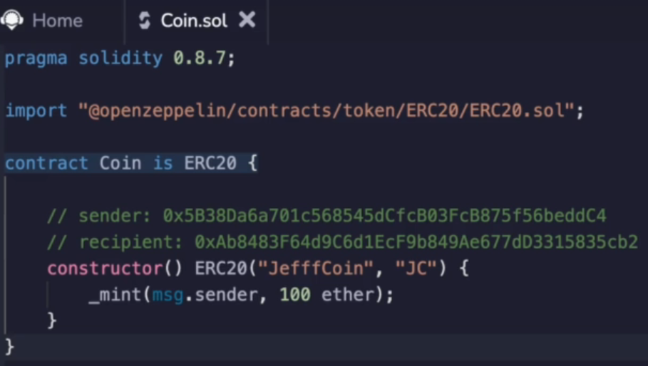
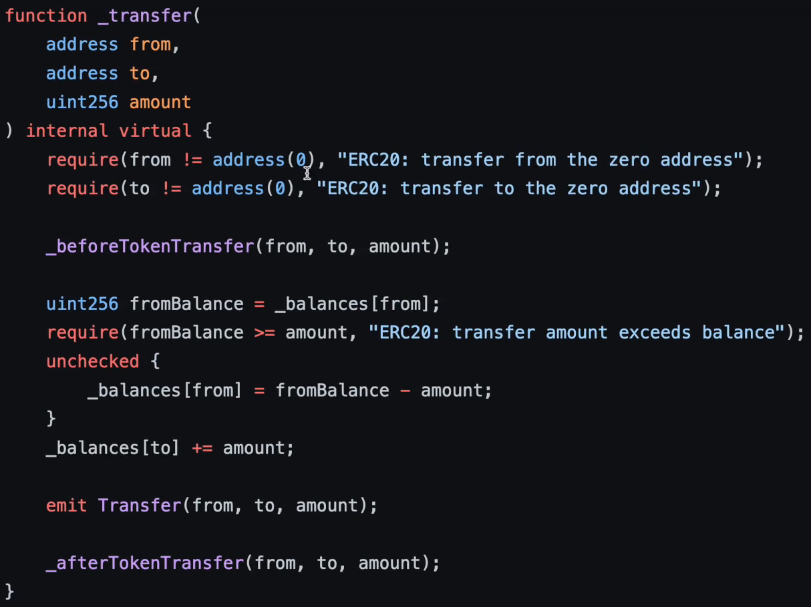
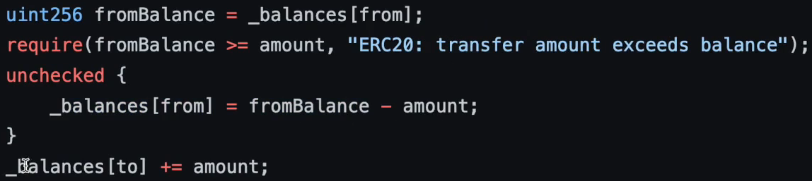
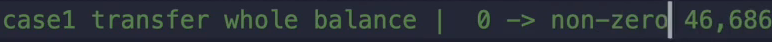
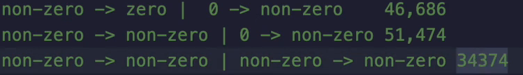
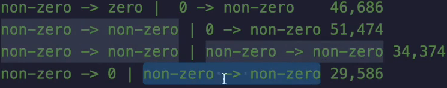
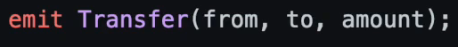

At the beginning of this course, we looked at different smart contracts that sometimes had different

gas costs, even though the function that was executed was the same after you saw the last video.

Hopefully it is obvious why that could be the case, especially if you were looking at those variable transitions in the terms of balances for an **ERC20 token**.

Let's run some benchmarks.

So I'm going to deploy this ERC20 token from earlier.

And and you'll be able to see that the balance of the deployer is this much or **100 coins**.

And the balance of the person who's about to receive it is **zero**, naturally, because we've just minted to the person who created the contract.

**What will happen if we send the entire balance to the sender is balance is going to ?**

If we look at the ERC20 `_transfer()` function

We're going to see that the **`from` balance** is going to be **set to zero** and the **`to` balance** is going to be set from **zero to non-zero**.

So these variables have store operations under the hood, which we've been studying so far.

After we conduct this transaction, we're going to see that the gas is **46,686**.

The optimizer is turned on here.

So for case one, where we transfer the entire balance and the recipient is 0 to 1, then the gas is, let's say, zero to non-zero.

It's **46,000**.

The next situation we're going to look at is where we **don't transfer the whole balance** and we have a **non-zero to zero situation**.

Now it's going to be non-zero to zero.

Let's try to make that a little bit more clear.

So this is non-zero to zero.

Okay, let's deploy this contract.

We will get our balance, but we're only going to send 1/10 of it.

So I'm going to remove this zero over here and set this to be the recipient.

When we conduct this transaction, the gas cost is higher.

Hopefully it's clear why that is the case right now because non-zero to non-zero does not get a refund.

And over here we went from zero to non-zero, which is expensive.

**So that's why this transaction cost 5000 gas more ?**

What would happen if we do non-zero to non-zero and do a non zero to non-zero over here?

We know that the recipient has a non-zero balance now, right?

So if we look at the balance of the recipient, they currently have 1/10 of what the first person originally had.

So let's conduct this transfer a second time because we know that the senders balance, the senders balances 90.

So if we send another ten coins, we conduct this transaction again, we're going to test out this case.

And in this situation, the gas cost is a little over **34,000 gas**.

So why would this be cheap?

Well, we're doing a non-zero to non-zero and another non-zero to non-zero.

So that's **21,000** + **5000** + **5000** takes us to **31,000**.

Then there's a bunch of **extra stuff** that the **ERC20 token** is doing here.

Looks good so far.

How about if we now **send the entire balance** from the **sender and the receiver** goes from non-zero to non-zero **again** ?

So this will become non-zero to zero and this will become non-zero.

Let's try it out.

First, let's get the balance of the center.

Then let's send the whole thing.

And the gas cost comes out to **29586 gas**.

Why is that the case?

Well, the non-zero to non-zero is 5000 and the non-zero to zero has to pay the 5000, but gets a refund.

So in reality, we're just paying that **21,000** plus that **extra 3000** cost that's floating around and the 5000 for doing this non-zero to non-zero transaction.

Now, if you're wondering where the **extra 3000** is coming from, we're not we haven't talked about **events** !

yet, but it's coming from this line because **when you meet an event, you're writing something to the blockchain** like a log and that's **stored in the blockchain forever**.

So Ethereum charges you more for it.

But the take away from this is you don't want to just test one scenario of your smart contract and say,

Oh, I think the gas cost is this.

You want to be thinking through the different situations that can happen if you're manipulating storage, because as you can see, the cost can vary quite a lot.