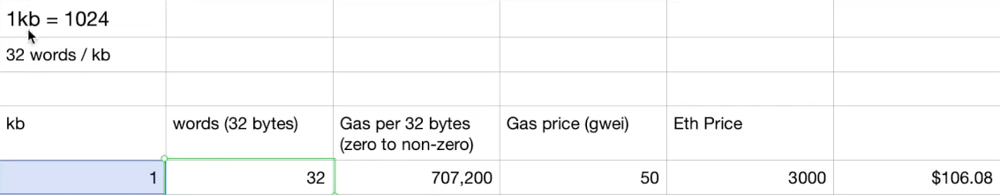

At this point, it will be very easy for us to calculate how much it would cost to store a file on Ethereum.

Maybe it's a document picture or a piece of music.

**One kilobyte** has **32 sets** of **32 bytes** in it.

So here we can just do some basic math about how much the gas will cost.

Each **kilobyte** has **32 sets** of **32 bytes**.

The gas to set a **32 byte storage slot** from **zero to non-zero** is **22,100**.

And let's just assume that the **gas price** is **50 Gwei**, the **ETH price** is **3000**, and the math will come out like this.

We just multiply the gas for each of these slots that we have to set by the gas price, by the ether, and then divide by 1 billion.

So **one kilobyte** will cost **$106**.

If I was to store something like the **picture** of this cat I got from Wikipedia, this is **292 kilobytes** or something like that.

So this is 292 and it would cost me **$30,000** to store this cat on the blockchain.

**That's quite expensive.**

So if you find yourself needing to keep a proof of record about about large files, like, let's say you have some sort of an agreement between two parties, it's probably not a good idea to put that agreement on the Ethereum blockchain because it's going to be quite costly.

What you could do is instead has put a **hash of that file** on the **Ethereum blockchain**.

So if there's a dispute, the party who is aggrieved will take the file, publish it, and take the hash of it and say, Hey, look, this is something we both agreed to in the past.

So whenever you're dealing with data on Ethereum, it's oftentimes better to think about how you can keep on temporal summaries of it on the blockchain rather than keeping the actual data.