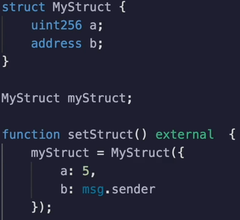

The **gas cost** of a **struct** is simply the **sum of all of the 32 byte values** that it uses and the manner in which they are used, whether they are red set from **zero to one**, **one to zero** or **non-zero to non-zero** as we looked at in the previous videos.

Let's look at a simple example here.

**`Mystruct`** has a `uint256` and an `address` in it.

But remember that an **address takes up 32 bytes** even though it's only 22 bytes long.

So we are going to set the struct with the integer **`5`** and **`msg.sender`**.

Let's **deploy** this contract and test out the **gas cost**.

When we do `setStruct()`, we are going to see that the gas cost is **65,516**.

Does this make sense?

We'll take this subtract away the transaction cost and we have to pay a **cold storage** rate from **zero to non-zero twice**.

Yes, this makes sense.

**44516** (transaction cost) - **22100** (cold storage cost) * **2** = **316**

What if we update **only one** of the **variables** with `setStructV2()` ?

What that's going to do is obviously keep **msg.sender** the **same**, but change **`a`** from **5 to 6**.

What do you expect this to come out to?

Obviously it's less.

It's **28,494**.  Let's work out these costs also.

We have a cost of 20849 for **21000** for the **transaction** and setting **methods** do not center to the same value is a **cold storage read** and a **warm access**.

So that's going to be 21000 -100.

This leaves us with 5000 294, which makes sense because we change the value from 5 to 6.

So this just leaves us with the extraneous up codes have needed to call the function.

So far so good.

If we change this struct to also include yet another to include yet another `uint256` item, hopefully the cost of this will be obvious to you.

We can't use this anymore.

So I'm going to compile, deploy and test, pass the video and see if you can work out what this number should be.

Okay.

It's **87261**.

Again, not to belabor the math, it's we're going to subtract away the **transaction cost** and then subtract 22,100 times three because we are writing **3 x 32 byte items** and we're left with 300 gas left over, which makes sense.

87261 - 22100 * 3 = **321**

Okay.

What if we have something a little bit trickier, like a **string** ?

So if this is a string and we write **lorem ipsum dolor** into that slot, what's it going to come out to be?

Well, as we looked at in a previous video, the strings behave like a ray.

And when everything **fits into a 31 bytes**, then this is going to **only live inside of a 32 byte slot**.

So this should be similar to what we saw over here.

And indeed it is.

It's **88,000** because this is **only taking up 32 byte**.

But remember, strings are a little bit tricky because when you can store both the length and the contents of the string inside of 32 bytes, it's only going to use up 32 bytes.

But once you use up two slots, then it needs to use three storage slots because it needs to store the length and all of the information that the string is holding over here.

What I'm doing is getting the slot for where my struct is and adding two to it because that's going to offset us from slot zero, slot one, slot two and get whatever is stored inside of here.

But I'm going to return it as a bytes 32 so that you get a better intuition of what's happening.

Compile set the struct to put the lorem ipsum Dolor that comment inside of it and get C and over here

you can see this is where the **lorem ipsum dolor** is living and this is how it knows it's inside of the slot and taking up a certain amount of space.

This actually is Lorem ipsum, because if I put it in here, I've already pasted it.

But here you can see it's **lorem ipsum dolor**.

As I was talking about, **if we have a longer string** that in this case is about **56 bytes long**

Then we're going to see that the value is going to jump up by **two storage slots**.

So again, clear deploy and test. In this situation, the **gas cost** is quite a bit **higher**. (**132514 gas**)

So what will happen if instead of a string we had a **boolean** over here, how much would it cost to store it?

It's probably in run.

Well, it's actually not going to be using up all three slots.

And here you can see that this is clearly only using **two slots** (**65539 gas**) because we have one **21,000** for the transaction and that will leave us about **44,000**, which is used up by the **two 22,000 transactions**.

Well, that's because **address** takes up **20 bytes** and that leaves 12 bytes** left** over, which is plenty of **room to put** this **boolean** in there.

And so **solidity** is going to try to **pack the variables**.

And this is something we'll talk more about in the next video.

But if you want to see what's actually inside of `c`, we can look over here.

Oh, well, because there is no slot to anymore then that's why it's returning zero.

So let's let's redo that deploy and see what's in there.

Okay.

We see the address that I'm actually using is `0x5B3`..., etc., etc.. `DC4`

And here you can see `5B3`

But there's this extra `1` (**one**) over here and that's the **`true` value** that's being **stored**.

If we had instead set this to `false`, you would see that set to **zero**.

And indeed that is the case.