In this video, we're going to be diving into **variable packing**.

This is when **two variables or more** are kept **in a single 32 byte slot**.

Over here we have two **128 bits** numbers that are **both stored** inside of the **same slot**.

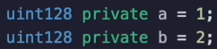

You can see this when we call the functions, `getSlotA()` and `getSlotB()`, both of them are going to return zero, zero and zero.

Now, the first thing that might be coming to your head would be, well, if they're both **in the same slot, how is the load instruction going to work ?**

Because we've been seeing that we would push the address of the storage before we would call an S load.

If that's the case, wouldn't something very strange come out of it and you would be correct?

If we execute `loadSlot0()`, what we are going to do is load the value that stored inside of slot zero.

And you can see that there is a **two** and a **one** here.

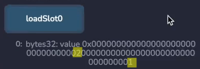

This would be a very strange number if this was converted to `uint256` and it certainly wouldn't correspond to either A or B

**How solidity deals with this is to also have an offset for the variable.**

So over here we have some more **assembly code**, but instead of getting the **slot**, we get the **offset**.

- That **slot** gives you the **storage location**.
- And **offset** gives you the **location within the storage location**.

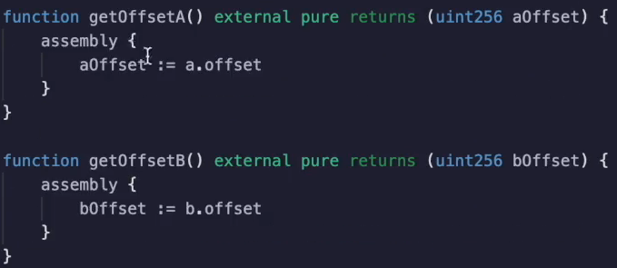

The **offset of `a`** is **zero**.

As you can see, it's the first variable and the one is over here.

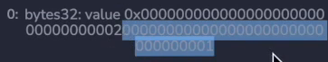

So this is the zero with offset `getOffsetB()` will return **16**.

And remember that there are **32 bytes** here.

So that's **halfway** to this side where the **two** are stored.

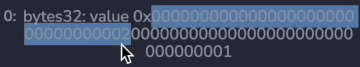

So when you are actually getting the value for `a` or the value for `b` under the hood, it needs :
- To read out the entire storage slot
- Then isolate the parts that are interesting

So if we do `getA()` we get **one** and `getB()` we get **two**.

That's not that's not surprising.

Well, let's see what the codes that are actually happening here are.

I'm going to debug this and it's going to `push1 0` onto the stack and `sload`.

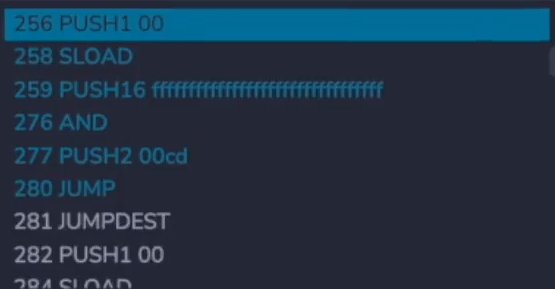

We've been seeing that several times, but it's also going to push a bunch of `0xff` (`push16 ffff...`) onto the stack and conduct an `and` operation.

What's that doing?

Now, looking at all these `ff` might be a little bit confusing, but if we get the length of this, that may give us some intuition.

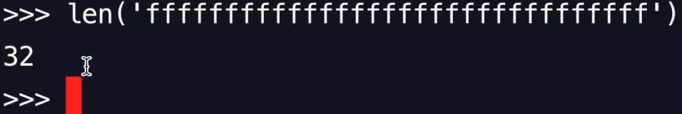

So there are 32 `f` over here, but remember **one byte** is a pair of these because **`0`** through **`F`** is **four bits**.

So this is a **byte** (`ff`).

So we have in reality, **16 bytes** over here.

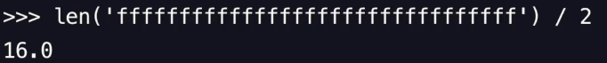

What's actually implied is that we have something that looks more like this.

And when you conduct an end operation over here

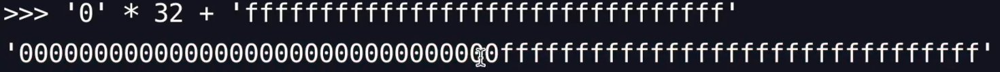

If you add something with zero, everything in this region will disappear.

And if you end with once, whatever it was previously will be carried over.

So that's how it's able to load up the storage slot and then mask over everything that's in B and force it to be zero so that only A is loaded.

You can see something similar happening when we look at the get B operation, except it's doing it in reverse.

So it loads up the zeroth slot S load and then it's going to push a0100000000.

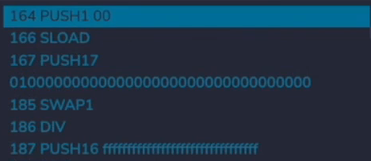

Well, all of these zeros are going to mask out the `a` so that only `b` is left.

And then there needs to be some more manipulation here in order to get `b` into the right location.

But you get the point, **it actually takes more work in execution if you are using a integer that is less than 256**.

So that is one thing to be mindful of, is that it actually costs more gas to use a **uint128** or smaller compared to a **uint256**.

If these were the regular **256 bits** types.

So I'm going to have to change the numbers like this compile, deploy and test over here.

This cost **23376 gas**.

Let's go back and make it a **128 bits**.

And this is the new value (**23403 gas**).

We see that it is clearly more expensive to `uint128` than a regular `uint256`.

That's because it has to do all of that **extra masking operation**.

So if that is the case, why would you ever use something less than 256 bits if it is less efficient?

Well, if you knew that you were going to be writing both of these variables in the same transaction, then it would make sense to pack them.

Let's look at this example.

Suppose you have an operation where people are staking coins when they stake it.

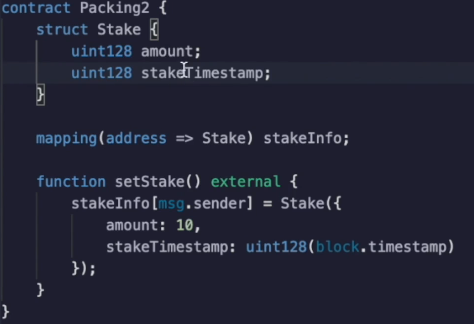

You want to record how much they staked and the time at which they staked it.

In this situation, all of this is going to fit into a single storage slot, so that will be cheaper gas cost wise compared to if these were both, you went to 56.

Let's see this in action.

And the gas cost is **43,475 gas**.

Now, I've done this calculation several times over, so I'm not going to repeat it again.

But you can see that we are clearly writing to **only one storage slot**.

If we have been writing down to this transaction would have been **considerably more expensive**.