**Looping over an array** is one of the first things you learn in programming.

The typical construction looks like this.

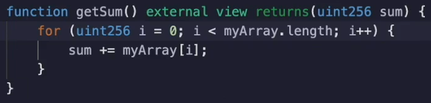

But in **solidity** this is **not the optimal way** to do it.

When the array is in storage, every time **`myArray.length`** is evaluated, we get a **warm storage** access which costs **100 gas**.

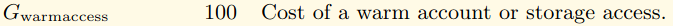

As you can see here, and this is something we've reviewed already when the array is long or even has more than a few items in it, this can add up quickly to see why this is a storage access.

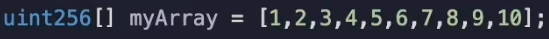

Let's load the storage slot where the array is. And see that the value is **10**.

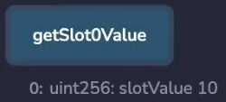

Over here, **10** is clearly the **length of the array**.

And you can see in plain sight that there is an **`sload`** over here.

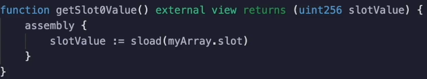

This is what happens when you do a report length instead of doing and **slowed in a loop**.

We should **cache the length** of the array so that we **only** do **one `sload`**.

Let's test the gas as ids, then add the cache so we can compare the before and after.

The gas cost in its current form is **49,119 gas**.

If we add the cash, it would look something like this.

Now let's test it in this form.

And we can see that the gas is now **48,124 gas**.

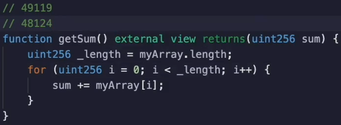

As you can see, we saved **almost 1000 gas**, which is to be expected because that's **ten** `sload` that were **saved**.

It's not quite 1000 because we had to pay a **tiny little bit extra** to do the **cache operation**.

I'll discuss this at the end of the video.

I should mention this technique only works if you expect the length of the array to be constant throughout the loop, and also that the array has a dynamic length.

If the array has fixed length, then this won't save gas when an array has fixed length.

The compiler knows its length and doesn't keep the value in storage.

If we make this fixed and recompile and test this

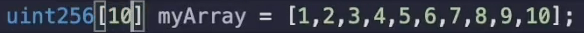

This `getSlot0Value()` function will instead **return the first item** inside of the array.

And here you can see this is indeed the case.

It gets **1** when the **first item** inside of the array is **1**.

This is what is actually stored in slot zero now.

Earlier we noted that we had to pay a tiny bit of extra gas to catch the length of the array.

**Five gas** to be exact.

I've already copied the opcodes from both version of the Smart contract into this text editor.

You can see in the **optimised case** on the left there is **191 opcodes**
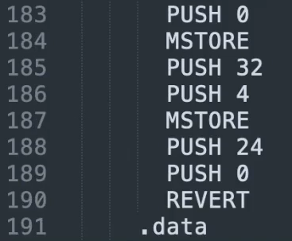

And in the **unoptimized case** there's **189 opcodes**.
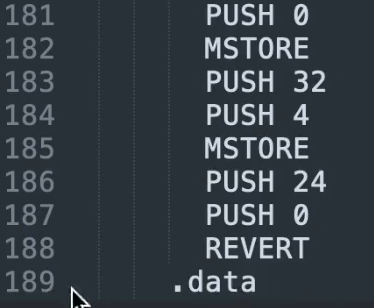

So that means **two extra opcodes** are being executed in the **optimized case**, which add **five more gas**.

So we see that we save **1000 gas**, but it's not quite 1000 gas.

We actually save **995 gas**.

So we **save 1000 gas** from reading the array length ten times, but **add five gas** back and that's because of **two extra opcodes**.

As you can see, we have **189** in one and **191** in the other.

Let's look at the **opcode side by side** so that we can see where this **extra five gas** is coming from.
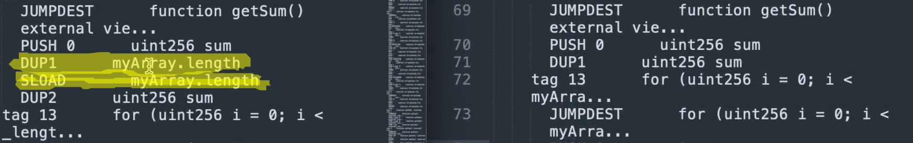

Over here, jump test is where the function get some begins.

So after the function selector is matched, it will jump to target six and we see a push zero, a dupe one in both cases.

But for the optimal case we cache it so we see that it's duplicating slot zero and then `sload`ing it and then duplicating it again.

In the non optimal case it jumps to its destination.

Does it push zero in a `dup1` just as in the optimal case?

And then it begins the loop.

The loop starts with a jump test because a loop needs to jump back to the beginning of the loop each time.

So there is an extra `dup2` outside of the loop in the optimal case.

And the other case, I'm going to have to use `vim diff` to make it a little bit more clear.

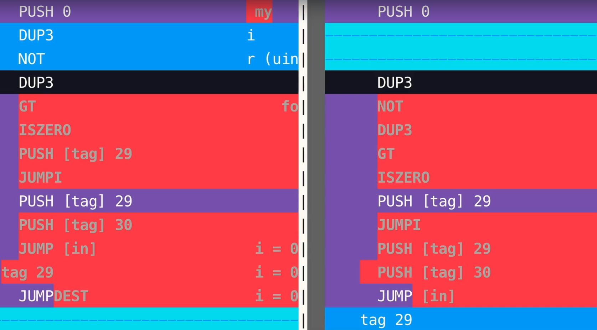

And you're going to see that after the loop is completed, there is an extra `pop` that happens.
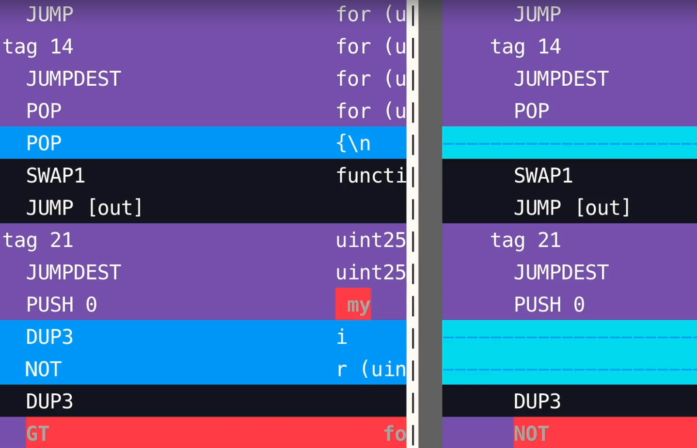

Well, that's because that extra duplicate needs to be cleared out before the function returns.

And a **pop costs two gas**, as we can see over here [**here**](https://ethereum.org/en/developers/docs/evm/opcodes/).
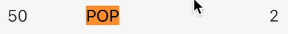

and a dupe costs **three gas**.

And **two plus three** is **five gas**.
