In this section, we're going to look at all of the gas costs that are associated with memory operations.

This is quite short.

There actually isn't that much information to it, but there are a few key things that you need to look out for.

The first thing that we're going to look at is when memory is used as part of a function call.

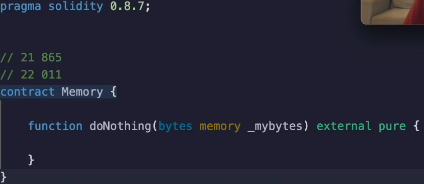

Now, when you pass in something like **bytes** or an **array**, but **bytes is actually an array of bytes** that's just syntactic sugar.

You have the choice of either specifying **`memory`** or a **`calldata`**.

If you do neither of them, then the **compiler** is going to **yell at you** and say that data location must be memory or calldata for this type.

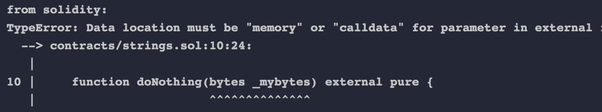

So let's look at the gas costs associated with each one and try to understand why they are what they are.

If we do call data and let's deploy and pass in `0x00ff00ff` to `doNothing()`.
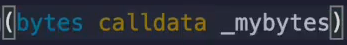

We see that the gas cost is **21,865**.

What will happen if we change this to `memory` ?
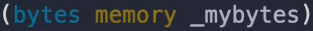

We'll pass on the **same value**.

This time it's **higher**.

It is **22,011 gas**. (**+ 146 gas**)

Why is that?

Well, under the hood, this `memory` is signaling that you need to **copy the data** out of the **call data** and into the **local memory**.

I'm not actually going to step through the opcodes, but you can get a pretty good idea of that's what's happening.

The input will look like this.

I copy the wrong thing.

The input data from the transaction will look like this.

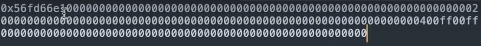

First of all, we have our **function selector**.

Remember that?

So this **`0x56fd66e1`** is coming from **56fd66e1**.

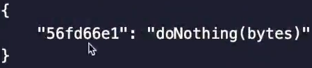

And when we send that transaction data portion, it's going to say, I want to talk to this function.

And then everything else is always broken up into 32 byte chunks.

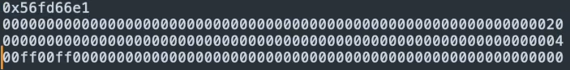

So there will be a number that represents 32 (`0x20`) over here.

But this is the interesting part.

It's going to say there are **four more bytes** (`04`) that are interesting.

And that's **00ff00ff**.

If we were to send something a little bit different, like `0x00ff00ffaa`


We run this, then we would see that the input data is going to change where it originally said four and it's going to become **five**, because now `aa` is part of the transaction.

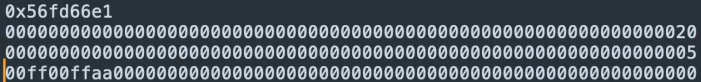

So how do you know that this zero zero is not part of the bytes array?

Well, that's because you **stop at the fifth byte**.

You can also see that the **gas cost will be higher** (**22023**), obviously, because of two reasons.

1. We're passing in more part of the transaction data. And remember, we have to pay more gas for that.
2. And then we're **copying** more data **into memory**.

So seeing that **memory is more expensive than call data**, why would you ever use memory instead of call data since this is clearly superior ?

If you ever **need to mutate `_mybytes` array**, you will not be able to do that with `calldata` because **call data cannot be changed**.

It's what was sent as part of the transaction.

**The extra non-zero bytes is more expensive than the zero byte.**

So if we wanted to do something like `_mybytes[0] = 0xaa;`.


This will **not compile** because it's saying **calleddata arrays are read only**.

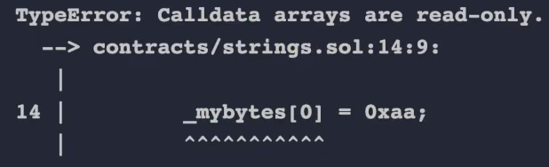

So let's say hypothetically that we wanted to return what we received, but change the first byte to a well, we could do it like this.

We could say my local bytes is equal, memory is equal to my rates.

And then we would.

I didn't specify the data type here.

Sorry.

This is in the wrong order.

Bytes memory.

My local data mileage.

My local bytes is equal to my bytes.

And then I could say my local bytes of zero is equal to 0xa, and then I could return my local bytes.

```javascript
function doNothing(bytes calldata _mybytes) external pure returns(bytes memory) {
    bytes memory _myLocalbytes = _mybytes;
    _myLocalbytes[0] = 0xaa;
    return _myLocalbytes;
}
```

In this scenario, what's the gas cost going to be?

00000f and we will see that we get 0500f back because the AA was swapped into the first byte.

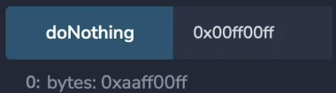

And the gas also shows associated with this was **22,442 gas**.

The more efficient way to do this would be to make this memory instead and then skip this step.

So if I do bytes, memory, my bytes, this will be skipped and I will just replace this variable like so.

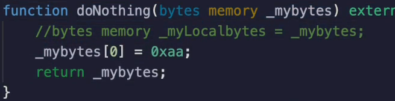

So let's deploy it and send in the same thing.

There is a F series f, and this time the gas cost is **22,419**, which is **cheaper** in this case.

So `memory` can be **cheaper** than `calldata` if you need to **mutate** this.

By the way, I do have the optimizer switched on.

I was thousand already.

So for whatever reason, **the Solidity Optimizer doesn't recognize that** this optimization will take place and you need to do it yourself.

If you're coming from something like `clang gcc`, you've probably given up on trying to outsmart the compiler at this point, but the **solidity compiler is not** as **mature** as those much older compilers.