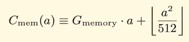
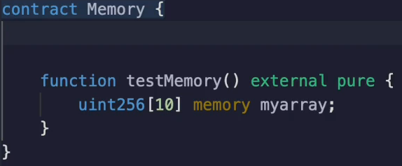
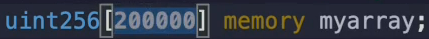
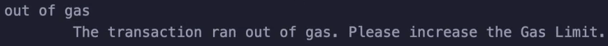

In this video, we're going to look at **memory cost explosion in Etherium**.

So memory, as you've seen so far, is relatively cheap to allocate as long as it's small, according to the [**Etherium Yellow Paper**](https://ethereum.github.io/yellowpaper/paper.pdf).

However, past a certain point, we should start seeing **quadratic growth** in the **gas costs** associated with **memory allocations**.

And the purpose of this is we don't want somebody to say allocate 100 terabytes of memory.

Otherwise no Ethereum client or at least very few Ethereum clients will be able to validate the blockchain.

Therefore, this gas explosion prevent that from happening.

Let's see it in action.

If I use this smart contract here which allocates ten **256 bits numbers**, then I'm going to see that the **gas cost** is **21,342**.

We can just **ignore the 21,000** part because we know that's part of the transaction.

So what would happen if I **increased** this to **20** ?

You cannot make dynamically sized arrays in memory, so I'm going to have to recompile this contract each time.

I can't pass it as a function argument, even though that would be a little bit faster.

When I test the memory this time, I see that it comes out to **403 gas**.

Okay, let's **increase** this again to **30**.

Compile and deploy and test.

Now it's **464 gas**.

We can see that this is **increasing at a linear rate**.

What would happen if we were to compare two much larger numbers to each other?

**What would happen if we allocated 10000 256 bits numbers ?**

We would see that the **gas cost** is about a quarter million **276,750**.

When we increase this to **20000**.

It's going to be a lot **more than twice** that because we're well into the quadratic zone of this formula over here.

So again, I will compile, deploy and test and we see that it costs nearly a **million gas** (**922844**).

This is going to be quite expensive for a user to actually execute this at almost a million gas.

This is similar to what we saw with tornado cash, remember?

So if we plug in the numbers, it could end up costing 100 or several hundred dollars, maybe even a thousand during **periods of high congestion**.

So we definitely don't want to allocate this much memory unless it's completely necessary.

**In fact, if we can break it up piece by piece to avoid hitting the quadratic part of the equation, all the better.**

Now, what will happen if I add another zero in here? (**200000**)

I encourage you to pause the video and think about it.

If you predicted that we're going to run **out of gas** because of the **block limit**, you were right.

So when I deploy and execute this, we're going to see that the transaction ran **out of gas**.

Please increase the gas limit.

Remember, the gas limit for a block is 30, **30 million** at this point in time.

And over here, we've crossed the 30 million mark for sure.

Therefore, **we can't even execute this**.

So this is what prevents Etherium clients from needing an infinite amount of memory, because the more memory you allocate, the gas cost is going to go up quadratics.

And at some point, you're not even going to fit inside of the block.