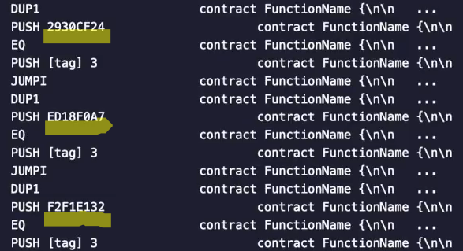

In this video, we're going to see **how the name of a function affects its gas cost**.

This might seem rather counterintuitive, but once you see the explanation, it actually makes a lot of sense.

Let's create a function called green that doesn't do anything except return the value one.

At this point, I'm pretty sure you know the drill.

We see that the gas cost is **21,210 gas**.

Now let's add another function that we are going to call **blue**, but I'm going to call the function **green instead of blue**.

When we looked at the gas costs, interestingly, they go up despite not touching the function `green()`.

So over here, `green()` now costs over here.

`green()` now costs **21,232 gas**.

Let's add yet another function.

**What will happen to the `green()` function now ?**

When we test the `green()` again, we see that the gas cost has increased again to **21,254**.

Now, here's something interesting.

What will the gas cost be of `blue()` ?

`blue()` cost **21,232 gas**, just like `green()`, costed on its second try when `red()` was not written yet.

**What will red cost ?**

`red()` costs **21,210 gas**, just like `green()` did before all of the other functions were added.

Well, if we look at what the compiler output is producing, the first thing we need to take note of is the **function hashes**.

- `blue()` is **ed18f0a7**
- `green()` is **f2f1e132**
- `red()` is **2930cf24**.

When we look at the actual **opcodes**, what happens is solidity needs to **check which function selector** was included in the transaction data.

1. So first it checks was `red()` picked. And if so, it's going to jump to execute red and then it's going to check.

2. Was `blue()` picked ?  And if so, it's going to execute the code for `blue()`.

3. And lastly, it's going to check was `green()` picked and then it's going to jump to the code for `green()`, if that's the case.

Again, these came from over here.

`red()` was **29**, something `green()` was **f2** and `blue()` was **ed**.

**The compiler will always sort these checks in hexadecimal order.**

So **29** is smaller than **ed** and is smaller than **F2**.

There are two takeaways from this.

1. **One is**, if you have a function that is very gas sensitive, you should try to make sure that its function selector is near the top.  And remember, the function selector is the first four bytes of the catch at 256 of the function name.  When that function is formatted according to the specification.

We talked about this in an earlier video.

2. **The other implication** is that if you are benchmarking a function to optimize its gas cost, you have to not change the name because you don't know that the changes are the result of the name of the function and thus it's function selector or if it's because of the changes you made inside of the function.

If you do the math, you're going to see that each of these **increases** are worth **22 gas** a piece.

This isn't a coincidence.

When we look at the opcodes over here, between each check we see that the instructions `eq`, `push`, `jumpi` (**jump if**) `dup1` are happening.

So I guess to include everything, each sequence is :
- A **push**
- An **equality check**
- A **push**
- A **conditional jump**
- A **duplicate**
- And then it **moves** on to the **next function**.

- A `push` will cost **3 gas**
- `eq` costs **3 gas**.
- `push` cost **3 gas**
- A conditional jump (`jumpi`) cost **10 gas**
- And a `dup1` cost **3 gas** over here.

So this is three plus three is six plus three is nine plus ten is nine.

Ten plus three is **22**.

So **for each unit** down, the function is that **adds** another **22 gas**.