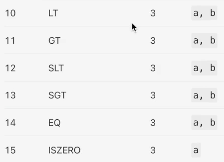
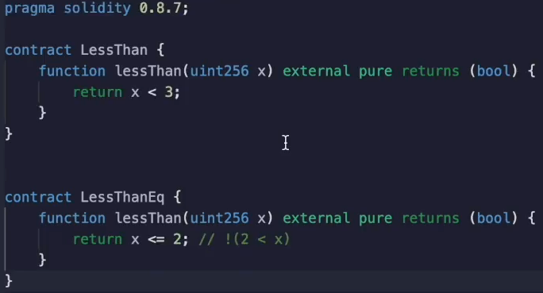
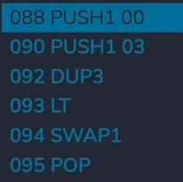
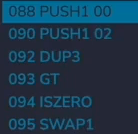
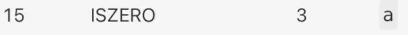
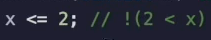

It's helpful to know which **opcodes** are used by the **Etherium virtual machine**.

So that way you can have an intuition if solidity construction is going to be efficient or not.

For example, Etherium has **less than and greater** than operator, but it doesn't have a **less than or equal to or greater** than or **equal to** operator.

So if you do **less than** or **equal to** or **greater than** or **equal to** in solidity, it's **not** going to translate to a **single opcode**.

The compiler is actually going to synthesize it out of the opcodes that are available to it and this **increases** the **gas cost**.

Let's see this in action over here.

We have two contracts.

One will check if `x` is less than three and the other one will check if it is **less than or equal** to **two**.

These are semantically equivalent, but we're going to see that under the hood, the solidity compiler creates something different.

Let's deploy the strict less than contract and debug it to see what's going on.

So we deploy the `LessThan` contract.

Let's apply it a value of two and debug it.

We see that it's going to push three onto the stack, which is what we expect from over here.

It's going to duplicate it and then it's going to do a less than okay.

No surprises.

It's just checking if `x` is **less** than **three**.

We expect to see that sequence of push three less then somewhere inside of the compiled opcode.

Let's see what the compiler does for less than or equal to.

I'm going to deploy the `LessThanEq` contract and run the same test, debug it.

And here we see a a push two onto the stack, which is to be expected.

It's duplicated and then we see a `gt` (greater than) and an `iszero`.

Okay well what is `iszero`.

Well, `iszero` rather predictably just checks if a number **is equal to zero**.

So the previous operation, the greater then will return a one or zero depending on the comparison.

And then `iszero` will simply invert that.

That is semantically equivalent saying not two less than x is the same as saying two is less than or equal to x.

So let's work through that.

If we have x is equal to two.

Two is not less than two.

But you flip that.

So it becomes true with three.

Three is greater than two, but you flip that it becomes false.

And it is false that three is less than or equal to two, and you can work out the other examples yourself.

The specific takeaway for this video is to prefer the cheaper comparison operator whenever possible.

**`<`** and **`>`** are more efficient than **`<=`** and **`>=`**

**`<`** and **`>`** require **TWO opcodes** : `LT` or `GT` and `ISZERO`

**Strict inequalities** only require **ONE opcode** : `GT` or `LT`

But the general takeaway is to think about how your solidity code maps to opcodes and to consider if you can create something semantically equivalent that is cheaper to execute.

Another example will be in the next video.
