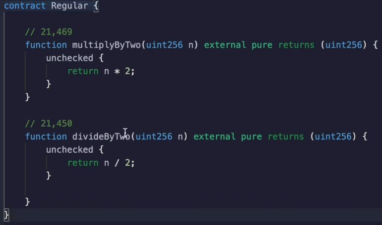
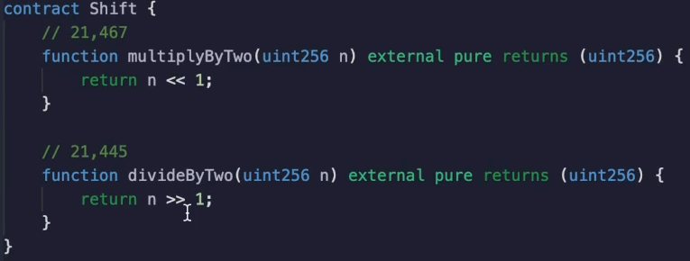

When you **multiply** or **divided** number by **power of two**, what you are really doing is shifting the bits that represent the number in binary to the left or to the right.

For example, five times two is ten.

But let's see this in binary.

So five in binary is equal to 101.

Let's add some leading zeros.

This is one plus four.

Because remember, you can convert the number from binary to decimal by multiplying the numbers in the 1 to 4, eight, 16 position and so forth, and then summing them up.

Five multiplied by two is ten.

So this is what it would look like in binary.

And you can see that this is a left shift.

Let's see if this actually worked.

This represents the one position, two, four and eight.

So we are adding two and eight together to get ten.

Okay.

That checks out.

Let's do the division case.

If we were to do a right shift by one, that would be the equivalent of five divided by two in integers, which is two solidity.

Cannot do floating point division.

So this would be 0010 and the one would fall off the end.

And we can see that this is two and five divided by two is two in integer.

To make a comparison between the two.

I've **removed** the **overflow** and **underflow** protection because when you shift numbers you do not have this protection in place.

So you will need to think about if this makes sense in the context of your application when you are doing this, **shifting, multiplying has the possibility of overflowing**.

So for example, if you shift your one values far enough that all of the ones fall off the left side and only zeros are left, then you're going to get an answer.

That doesn't make sense.

But I will talk about **how to fix** this in the next video.

With Division, you don't have this problem because it doesn't matter how large a number you divide by.

If the denominator is larger than the numerator, it will always be zero in integer division.

I've already been doing plenty of gas benchmarks, so I'm just going to show you the results.

This is where the optimizer turned on.

We can see that multiplied by two.

Then in the traditional way costs **21,469 gas**.

But when we use shifting, we **save 2 gas**.

And this is not to be a surprise.

The opcode for **multiplication** is **five gas**, but the opcode for **shifting** is **three gas**.

In the division case we actually save five gas.

This is another example of thinking about how to accomplish the same computation with our codes that are cheaper.