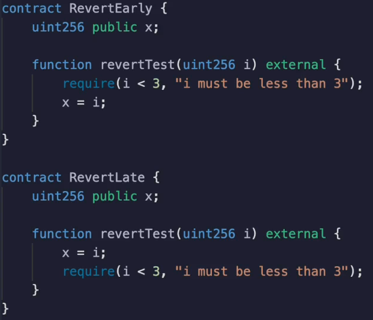
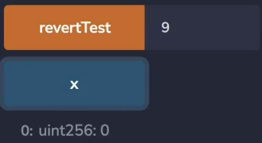
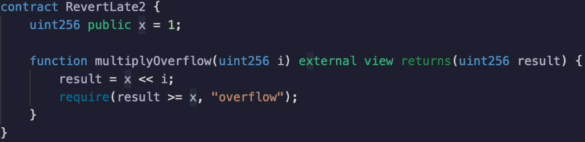
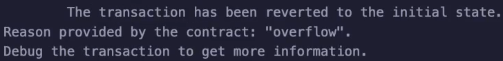

Etherium **transactions that revert** still have to **pay gas**.

If they run out of gas, they pay the full limit.

If they revert because they hit a **revert opcode** such as from a require statement or because they caused an integer to **overflow** and there was overflow protection in place, they pay the gas up until that revert opcode was hit, but they **don't pay for the gas afterwards**.

The implication of this is that **we should revert as early as possible** in the execution to save the user gas in case the transaction reverts.

Let's look at two examples.

- In one, we will **write to storage** and **then revert**.
- In another we will **revert before we write** to storage.

Let's see this in action again.

These are in separate contracts because we want to keep the function names the same as we have discussed about in an earlier video.

Let's test the **`RevertEarly` contract**.

This will revert if we supply a number that is bigger than three.

So let's do that.

We revert and we see that the gas cost is **21,549**.

Okay, let's test the **`RevertLate` contract** first we will write the value nine to storage and then we will check

if I is less than three.

When we execute this transaction, we see that the gas is actually quite a lot higher at **43,685**.

This **extra 20,000** is obviously coming from the storage being written to something interesting happens

though even though we wrote nine to X before we reverted, nine is not the value that will be inside of x.

When we check x, we get zero.

In fact, we get **zero in both cases**.

That's because when a revert opcode is hit, any state changes that took place, whether it's a logging, a write to storage or transfer of ether, a creation of a contract or whatever, all of that gets undone.

**It's only if everything succeeds that the state changes succeed too.**

I should note that just because **it's preferable to revert before a state change or any computation in general**, that doesn't make it a hard and fast rule.

Let's go back to the shifting example.

We noted that when you do multiplication, there could be an overflow.

Trying to anticipate if the overflow is going to take place would be quite complicated.

**In this case, it's simpler to revert afterwards.**

When we do a multiplication by a positive number, we expect that the result is going to be bigger than the original value.

If it were shifted by zero, it would be the same, but if it were shifted by one or more, results should be greater than X.

But if result ends up being zero, then we would want to revert because we knew an overflow took place.

Let's see this in action.

I'm going to **shift** the **bits** left **by 256**, which isn't possible because that would make the one fall off the left side.

And we see that the transaction **revert** with **overflow** in this situation.

We can revert after the computation took place because trying to anticipate if the computation will revert may make it actually more expensive.

This is a separate topic, but if you are interacting with an address that may or may not be a smart

contract and may or may not be untrusted, you may want to put require statements after your interaction to revert in case that smart contract did something malicious over here.

It's not really an issue that the user had to pay the gas cost for the malicious activity the other contract was doing.

It's more important to revert in this case than to save the user guess.