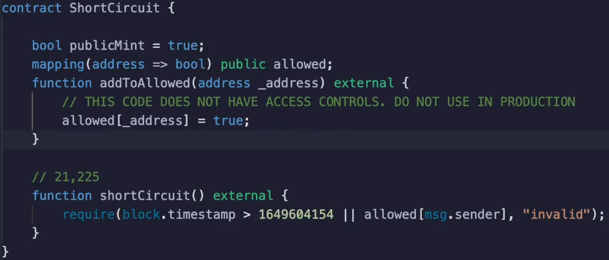
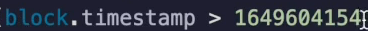
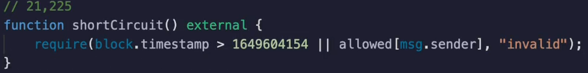
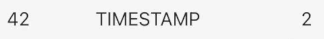

Like most languages **Solidity** shortcut evaluates `and` and `or` **operators**.

When you evaluate **`x` or `y`** that is `boolean` `or` and you know that `x` is `true`, then it doesn't matter if y is `true` or `false`.

So if this evaluates to `true`, then this **operation will be skipped**.

The converse of this happens for the end operation.

If you are conducting the operation X and Y and x is equal to false, then it doesn't matter what y is because the entire expression will evaluate to false.

So if X is false, then Y will not be evaluated.

If there is a substantial difference in gas cost between either of these expressions, then oftentimes it's worthwhile to **put the cheaper** 1/1 so that perhaps the more expensive one might get shortcut.

This here is a common example where you are conducting a token sale.

People might be able to buy the token if a certain time has passed or if they are on an analyst over here.

**The order matters.**

In this particular setup, the allow list needs to read from memory and we know this cost **2100 gas**.

On the other hand, **checking the block timestamp** cost **2 gas** as we can see over here.

Now, of course, there is a nuance to this.

If you expect all of the tokens to be sold during the presale and none after the timestamp, then it would actually make sense to evaluate this in the opposite order.

So if you want to be technical, you need to multiply the gas costs multiplied by the likelihood that the check will take place.

So if you expect the timestamp to never be relevant, then in that case it would be worthwhile to flip them.

But you would have to be extremely sure of that because this check costs **2100 gas** and this check only cost **two gas**.

So you would need to be almost completely certain that is the case for the flip to be worthwhile.