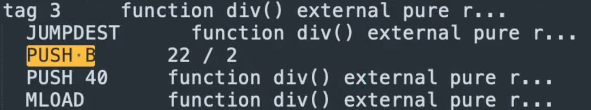

Unlike other compilers, you cannot always rely on the solidity compiler to carry out **constant expressions** and store the result in the compilation output.

Let's look at some examples over here.

We're going to look at multiplication and see **3 x 7**, which is **0x15**.

The solidity compiler will succeed in detecting that this expression never changes and will hard code the output inside of the bytecode.

**3 x 7** is **21** in **decimal**, which is **15** in **hexadecimal**.

So we expect to see a **`push 15`** somewhere inside of the bytecode when we compile this over here, I've pasted the byte code and if I look for **`push 15`**, there it is.

And they've nicely told us that this comes from the **3 x 7**.

The same thing will happen for the **division case**.

**22 / 2** is **11**, which is **0x0b**, so we expect to see a **`push b`** appearing in a similar manner.

And there it is.

If you want to be sure that that push be came from the relevant function and isn't some opcode in another part of your contract, you can trace backwards to make sure that it goes back to the **function selector** where you expect it to be.

So **`push B`** is inside of **`tag 3`**.

Over here.

**`tag 3`** is pushed onto the stack before a **`jumpi`** and that's conditioned on something being equal to what looks like a **function selector** **`F9FA48C3`**.

And if we look at the function selector, we will see it over there and see that they match.

Let's look at a case where the optimization does not take place over here.

The **Solidity Optimizer** does not recognize this is actually the same thing. **22 / 2**.

I don't think it can be reliably predicted for when the solidity optimizer will fail to recognize that an optimization can take place.

But if something is happening across several variables, it's not that reliable.

Let's look at the opcodes for this.

But before we do, one interesting thing to note about the previous compiler output is that the `div` opcode didn't appear anywhere.

So here we have the `div` function, but we would expect the opcode for actually executing division to appear somewhere inside of the opcodes.

But because it was optimized away, the div opcode appears nowhere inside of here.

That isn't the case in this scenario.

When I compile this and copy out the assembly code and examine it, we will see that the opcode is in fact present because it is carrying out a division.

Now let's look at the individual parts.

We expect two and **22** to be pushed onto the stack at some point.

So we should see a `push 2` somewhere.

There it is.

And we also see a `push 16`, which is **hexadecimal for 22**.

You can know that because A10 in hexadecimal is 16 and 16 plus six is 22.

So it's pushing both of these numbers onto the stack and then actually dividing them over here.

The next scenario we are going to look at is **`hash` functions**.

This will properly optimize the `keccak256()` and then taking the first four bytes will result in **3ccfd60b**.

[**Keccak-256 Online**](http://emn178.github.io/online-tools/keccak_256.html)

`withdraw()` --> **3ccfd60b**

And we expect to see that inside of the byte code **3ccfd60b**

I forgot to mention that, but this is the **first four bytes** and the solidity compiler has optimized it so that the result of the hash and then taking the first four bytes is there.

However, this breaks down if we are doing a type conversion, I don't know if this is part of the specification of the compiler or not, but regardless, it's something that you should be aware of.

Over here, we're taking a hash of something that is clearly a constant, but the solidity compiler does not compile it in that manner.

Here is the byte code and we can see that it actually carries out a `keccak256()` hash function.

If I look at the earlier byte code, which I just did by hitting command Z over here, then I see that there is no `keccak256()` byte code anywhere.

These are just comments, but the actual byte code is non-existent.

Let's look at an example with an exponent.

The key bytecode that we will be looking for here is **`EXP`**.

Again, this is a constant because it's two to the one is equal to two, but that's not what will be carried out by the compiler.

And there it is.

This is taking the exponential ation even though it's constant and exponential and will have variable gas costs depending on the size of the data that you are passing in.

So it would be **much cheaper if you manually evaluated this first** and started the byte code.

Now there can be an **advantage** sometimes to leaving code as an expression because it makes your **code more clear**.

But you want to look through the compiler output to make sure that the compiler is actually evaluating everything.

Otherwise, for one year, deployment costs will be higher because there will be more opcodes and two of the execution costs for your user will be higher because they will be executing up codes when they could have just been executing only one, which is pushing on the evaluation of that expression.